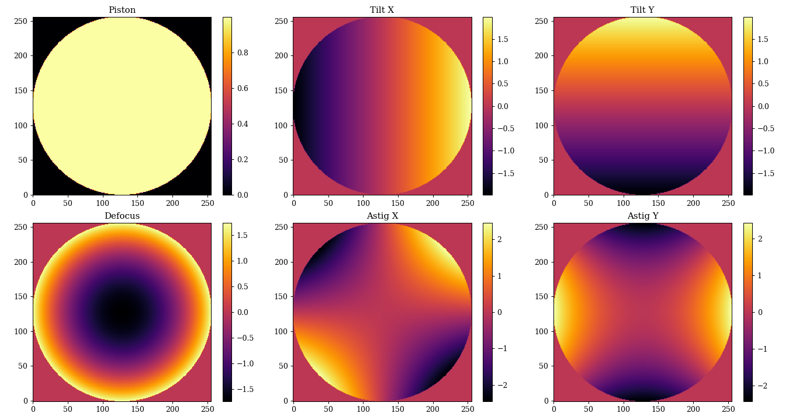

# Aberrations

The aberrations module provides a place for dynamically generated aberrations. Presently on the Zernike polynomials are implemented, but more aberrations can be added in the future. These can be used independently but are typically used in conjunction with the `AberratedAperture` class.

Lets have a look at how to construct a Zernike Basis:

```python
import dLux as dl

zernike_basis = dl.ZernikeBasis(np.arange(1, 7))
print(zernike_basis)
```

```python
> ZernikeBasis(
>   zernikes=[
>     Zernike(j=1, n=0, m=0, name='Piston', _k=f32[1], _c=f32[1]),
>     Zernike(j=2, n=1, m=1, name='Tilt X', _k=f32[1], _c=f32[1]),
>     Zernike(j=3, n=1, m=-1, name='Tilt Y', _k=f32[2], _c=f32[2]),
>     Zernike(j=4, n=2, m=0, name='Defocus', _k=f32[2], _c=f32[2]),
>     Zernike(j=5, n=2, m=-2, name='Astig X', _k=f32[3], _c=f32[3]),
>     Zernike(j=6, n=2, m=2, name='Astig Y', _k=f32[1], _c=f32[1])
>   ]
> )
```

??? abstract "Plotting code"
    ```python
    import matplotlib.pyplot as plt

    # Calcualte coordinates

    npix = 256
    coords = dl.utils.get_pixel_positions((npix, npix), (2/npix, 2/npix))
    basis = zernike_basis.calculate_basis(coords)

    plt.figure(figsize=(15, 8))
    for i in range(len(basis)):
        plt.subplot(2, 3, i+1)
        plt.title(f"{zernike_basis.zernikes[i].name}")
        plt.imshow(basis[i])
        plt.colorbar()
    plt.tight_layout()
    plt.savefig("assets/zernike.png")
    ```



??? info "Zernike Basis API"
    :::dLux.aberrations.ZernikeBasis

??? info "Zernike API"
    :::dLux.aberrations.Zernike

# Aberrations Factory

The `AberrationsFactory` class is a convenience class for generating aberrations. It operates very similarly to the `ApertureFactory` class. It takes in a list of aberration names and a list of coefficients and returns a `ZernikeBasis` object. This class is not actually ever instatiated, but is rather a class used to give a simple constructor interface that is used to construct the most commonly used aberrations. It is able to construct hard-edged circular or regular poygonal aberrations.

Lets look at an example of how to construct a simple circular aberration class. Let calcualte this for a 512x512 array with the aperture spanning the full array.

```python
import dLux as dl
from jax import numpy as np, random as jr

# Construct Zernikes

zernikes = np.arange(4, 11)
coefficients = jr.normal(jr.PRNGKey(0), (zernikes.shape[0],))

# Construct aberrations

aberrations = dl.AberrationFactory(512, zernikes=zernikes,
                                   coefficients=coefficients)
print(aberrations)
```

```python
> ApplyBasisOPD(
>   name='CircularAperture',
>   basis=f32[7,512,512],
>   coefficients=f32[7]
> )
```

As we can see this returns an `ApplyBasisOPD` class, as this is able to apply the aberations independently of any apertures. Aberrations can be generated from an aperture class using either the `ApertureFactory` or an `AberratedAperture` class.