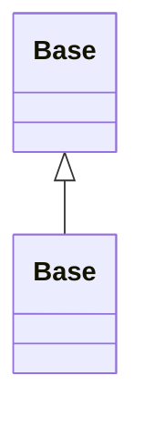

<!-- Generated by docs/scripts/generate_api_mds.py; do not edit. -->

# Base

## Inheritance

```mermaid
classDiagram
    class dLux_base_Base["Base"]
    class zodiax_base_Base["Base"]
    zodiax_base_Base <|-- dLux_base_Base
    click dLux_base_Base href "#dLux.base.Base" "Methods: save(), load(), get(), set(), add(), multiply(), divide(), power(), min(), max()"
```

???+ info "Base"
    ::: dLux.base.Base
