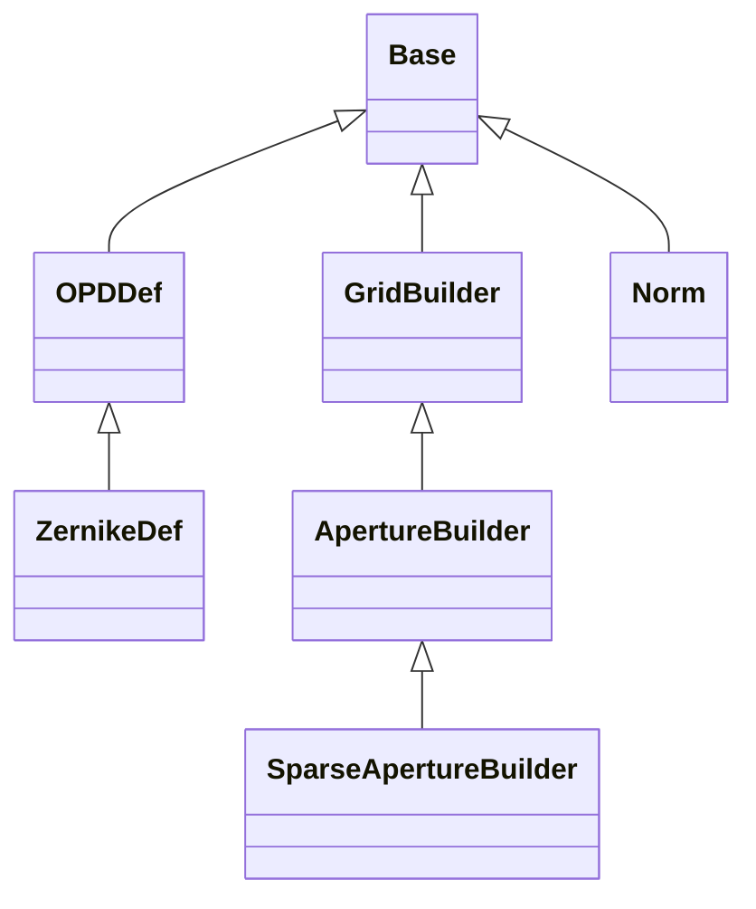

<!-- Generated by docs/scripts/generate_api_mds.py; do not edit. -->

# Builders

## Inheritance

???+ info "GridBuilder"
    ::: dLux.builders.GridBuilder

???+ info "OPDDef"
    ::: dLux.builders.OPDDef

???+ info "Norm"
    ::: dLux.builders.Norm

???+ info "ZernikeDef"
    ::: dLux.builders.ZernikeDef

???+ info "ApertureBuilder"
    ::: dLux.builders.ApertureBuilder

???+ info "SparseApertureBuilder"
    ::: dLux.builders.SparseApertureBuilder
