<!-- Generated by docs/scripts/generate_api_mds.py; do not edit. -->

# Compatibility

## Inheritance

```mermaid
classDiagram
    class dLux_compatibility_ABCDConjugatePlane["ABCDConjugatePlane"]
    class dLux_compatibility_AddConstant["AddConstant"]
    class dLux_compatibility_ASMPropagator["ASMPropagator"]
    class dLux_compatibility_AberratedAperture["AberratedAperture"]
    class dLux_compatibility_AngularOpticalSystem["AngularOpticalSystem"]
    class dLux_compatibility_ApplyJitter["ApplyJitter"]
    class dLux_compatibility_ApplyPixelResponse["ApplyPixelResponse"]
    class dLux_compatibility_ApplySaturation["ApplySaturation"]
    class dLux_grids_BaseCoordTransform["BaseCoordTransform"]
    class dLux_compatibility_BaseDetector["BaseDetector"]
    class dLux_compatibility_BaseOpticalSystem["BaseOpticalSystem"]
    class dLux_compatibility_BaseSpectrum["BaseSpectrum"]
    class dLux_compatibility_BasisLayer["BasisLayer"]
    class dLux_compatibility_BasisOptic["BasisOptic"]
    class dLux_compatibility_CartesianOpticalSystem["CartesianOpticalSystem"]
    class dLux_compatibility_CircularAperture["CircularAperture"]
    class dLux_compatibility_CompoundAperture["CompoundAperture"]
    class dLux_compatibility_CoordSpec["CoordSpec"]
    class dLux_compatibility_CoordTransform["CoordTransform"]
    class dLux_compatibility_DistortedCoords["DistortedCoords"]
    class dLux_compatibility_Dither["Dither"]
    class dLux_compatibility_FFT["FFT"]
    class dLux_compatibility_FFTPropagator["FFTPropagator"]
    class dLux_compatibility_Instrument["Instrument"]
    class dLux_compatibility_LayeredDetector["LayeredDetector"]
    class dLux_compatibility_LayeredOpticalSystem["LayeredOpticalSystem"]
    class dLux_compatibility_MFT["MFT"]
    class dLux_compatibility_MFTPropagator["MFTPropagator"]
    class dLux_compatibility_MultiAperture["MultiAperture"]
    class dLux_compatibility_PadSpec["PadSpec"]
    class dLux_compatibility_ParametricOpticalSystem["ParametricOpticalSystem"]
    class dLux_compatibility_ParametricLayeredOpticalSystem["ParametricLayeredOpticalSystem"]
    class dLux_compatibility_PointResolvedSource["PointResolvedSource"]
    class dLux_compatibility_PointSource["PointSource"]
    class dLux_compatibility_PointSources["PointSources"]
    class dLux_compatibility_PSF["PSF"]
    class dLux_compatibility_PolySpectrum["PolySpectrum"]
    class dLux_compatibility_RectangularAperture["RectangularAperture"]
    class dLux_compatibility_RegPolyAperture["RegPolyAperture"]
    class dLux_compatibility_ResolvedSource["ResolvedSource"]
    class dLux_compatibility_Rotate["Rotate"]
    class dLux_compatibility_Scene["Scene"]
    class dLux_grids_BaseGridSpec["BaseGridSpec"]
    class dLux_compatibility_SquareAperture["SquareAperture"]
    class dLux_compatibility_Telescope["Telescope"]
    class dLux_compatibility_Zernike["Zernike"]
    class dLux_base_Base["Base"]
    class dLux_compatibility_LegacyDetectorLayer["LegacyDetectorLayer"]
    class dLux_fields_Intensity["Intensity"]
    class dLux_grids_Distortion["Distortion"]
    class dLux_grids_GridSpec["GridSpec"]
    class dLux_grids_ResizeSpec["ResizeSpec"]
    class dLux_layers_propagation_ABCDFraunhofer["ABCDFraunhofer"]
    class dLux_layers_propagation_ABCDPropagator["ABCDPropagator"]
    class dLux_layers_propagation_Fraunhofer["Fraunhofer"]
    class dLux_sources_Source["Source"]
    class dLux_systems_DetectorSystem["DetectorSystem"]
    class dLux_systems_OpticalSystem["OpticalSystem"]
    dLux_layers_propagation_ABCDFraunhofer <|-- dLux_compatibility_ABCDConjugatePlane
    click dLux_compatibility_ABCDConjugatePlane href "#dLux.compatibility.ABCDConjugatePlane" "No direct public attributes or methods"
    dLux_compatibility_LegacyDetectorLayer <|-- dLux_compatibility_AddConstant
    click dLux_compatibility_AddConstant href "#dLux.compatibility.AddConstant" "Attributes: value"
    click dLux_compatibility_ASMPropagator href "#dLux.compatibility.ASMPropagator" "No direct public attributes or methods"
    click dLux_compatibility_AberratedAperture href "#dLux.compatibility.AberratedAperture" "No direct public attributes or methods"
    click dLux_compatibility_AngularOpticalSystem href "#dLux.compatibility.AngularOpticalSystem" "No direct public attributes or methods"
    dLux_compatibility_LegacyDetectorLayer <|-- dLux_compatibility_ApplyJitter
    click dLux_compatibility_ApplyJitter href "#dLux.compatibility.ApplyJitter" "Attributes: sigma, kernel_size, oversample · Properties: kernel"
    dLux_compatibility_LegacyDetectorLayer <|-- dLux_compatibility_ApplyPixelResponse
    click dLux_compatibility_ApplyPixelResponse href "#dLux.compatibility.ApplyPixelResponse" "Attributes: pixel_response"
    dLux_compatibility_LegacyDetectorLayer <|-- dLux_compatibility_ApplySaturation
    click dLux_compatibility_ApplySaturation href "#dLux.compatibility.ApplySaturation" "Attributes: threshold"
    dLux_base_Base <|-- dLux_grids_BaseCoordTransform
    click dLux_grids_BaseCoordTransform href "#dLux.grids.BaseCoordTransform" "Methods: get_coordinates(), apply()"
    click dLux_compatibility_BaseDetector href "#dLux.compatibility.BaseDetector" "No direct public attributes or methods"
    click dLux_compatibility_BaseOpticalSystem href "#dLux.compatibility.BaseOpticalSystem" "No direct public attributes or methods"
    click dLux_compatibility_BaseSpectrum href "#dLux.compatibility.BaseSpectrum" "No direct public attributes or methods"
    click dLux_compatibility_BasisLayer href "#dLux.compatibility.BasisLayer" "No direct public attributes or methods"
    click dLux_compatibility_BasisOptic href "#dLux.compatibility.BasisOptic" "No direct public attributes or methods"
    click dLux_compatibility_CartesianOpticalSystem href "#dLux.compatibility.CartesianOpticalSystem" "No direct public attributes or methods"
    click dLux_compatibility_CircularAperture href "#dLux.compatibility.CircularAperture" "No direct public attributes or methods"
    click dLux_compatibility_CompoundAperture href "#dLux.compatibility.CompoundAperture" "No direct public attributes or methods"
    dLux_grids_GridSpec <|-- dLux_compatibility_CoordSpec
    click dLux_compatibility_CoordSpec href "#dLux.compatibility.CoordSpec" "Properties: xs, fov, extent"
    dLux_grids_BaseCoordTransform <|-- dLux_compatibility_CoordTransform
    click dLux_compatibility_CoordTransform href "#dLux.compatibility.CoordTransform" "Attributes: translation, rotation, compression, shear"
    dLux_grids_Distortion <|-- dLux_compatibility_DistortedCoords
    click dLux_compatibility_DistortedCoords href "#dLux.compatibility.DistortedCoords" "Methods: calculate()"
    click dLux_compatibility_Dither href "#dLux.compatibility.Dither" "No direct public attributes or methods"
    dLux_layers_propagation_Fraunhofer <|-- dLux_compatibility_FFT
    click dLux_compatibility_FFT href "#dLux.compatibility.FFT" "No direct public attributes or methods"
    dLux_layers_propagation_ABCDPropagator <|-- dLux_compatibility_FFTPropagator
    click dLux_compatibility_FFTPropagator href "#dLux.compatibility.FFTPropagator" "No direct public attributes or methods"
    click dLux_compatibility_Instrument href "#dLux.compatibility.Instrument" "No direct public attributes or methods"
    dLux_systems_DetectorSystem <|-- dLux_compatibility_LayeredDetector
    click dLux_compatibility_LayeredDetector href "#dLux.compatibility.LayeredDetector" "Methods: model()"
    dLux_systems_OpticalSystem <|-- dLux_compatibility_LayeredOpticalSystem
    click dLux_compatibility_LayeredOpticalSystem href "#dLux.compatibility.LayeredOpticalSystem" "Properties: wf_npixels, diameter"
    dLux_layers_propagation_Fraunhofer <|-- dLux_compatibility_MFT
    click dLux_compatibility_MFT href "#dLux.compatibility.MFT" "No direct public attributes or methods"
    dLux_layers_propagation_ABCDPropagator <|-- dLux_compatibility_MFTPropagator
    click dLux_compatibility_MFTPropagator href "#dLux.compatibility.MFTPropagator" "No direct public attributes or methods"
    click dLux_compatibility_MultiAperture href "#dLux.compatibility.MultiAperture" "No direct public attributes or methods"
    dLux_grids_ResizeSpec <|-- dLux_compatibility_PadSpec
    click dLux_compatibility_PadSpec href "#dLux.compatibility.PadSpec" "No direct public attributes or methods"
    click dLux_compatibility_ParametricOpticalSystem href "#dLux.compatibility.ParametricOpticalSystem" "No direct public attributes or methods"
    click dLux_compatibility_ParametricLayeredOpticalSystem href "#dLux.compatibility.ParametricLayeredOpticalSystem" "No direct public attributes or methods"
    click dLux_compatibility_PointResolvedSource href "#dLux.compatibility.PointResolvedSource" "No direct public attributes or methods"
    dLux_sources_Source <|-- dLux_compatibility_PointSource
    click dLux_compatibility_PointSource href "#dLux.compatibility.PointSource" "No direct public attributes or methods"
    dLux_sources_Source <|-- dLux_compatibility_PointSources
    click dLux_compatibility_PointSources href "#dLux.compatibility.PointSources" "No direct public attributes or methods"
    dLux_fields_Intensity <|-- dLux_compatibility_PSF
    click dLux_compatibility_PSF href "#dLux.compatibility.PSF" "Properties: pixel_scale, ndim"
    click dLux_compatibility_PolySpectrum href "#dLux.compatibility.PolySpectrum" "No direct public attributes or methods"
    click dLux_compatibility_RectangularAperture href "#dLux.compatibility.RectangularAperture" "No direct public attributes or methods"
    click dLux_compatibility_RegPolyAperture href "#dLux.compatibility.RegPolyAperture" "No direct public attributes or methods"
    dLux_sources_Source <|-- dLux_compatibility_ResolvedSource
    click dLux_compatibility_ResolvedSource href "#dLux.compatibility.ResolvedSource" "No direct public attributes or methods"
    click dLux_compatibility_Rotate href "#dLux.compatibility.Rotate" "No direct public attributes or methods"
    click dLux_compatibility_Scene href "#dLux.compatibility.Scene" "No direct public attributes or methods"
    dLux_base_Base <|-- dLux_grids_BaseGridSpec
    click dLux_grids_BaseGridSpec href "#dLux.grids.BaseGridSpec" "No direct public attributes or methods"
    click dLux_compatibility_SquareAperture href "#dLux.compatibility.SquareAperture" "No direct public attributes or methods"
    click dLux_compatibility_Telescope href "#dLux.compatibility.Telescope" "No direct public attributes or methods"
    click dLux_compatibility_Zernike href "#dLux.compatibility.Zernike" "No direct public attributes or methods"
```

???+ info "ABCDConjugatePlane"
    ::: dLux.compatibility.ABCDConjugatePlane

???+ info "AddConstant"
    ::: dLux.compatibility.AddConstant

???+ info "ASMPropagator"
    ::: dLux.compatibility.ASMPropagator

???+ info "AberratedAperture"
    ::: dLux.compatibility.AberratedAperture

???+ info "AngularOpticalSystem"
    ::: dLux.compatibility.AngularOpticalSystem

???+ info "ApplyJitter"
    ::: dLux.compatibility.ApplyJitter

???+ info "ApplyPixelResponse"
    ::: dLux.compatibility.ApplyPixelResponse

???+ info "ApplySaturation"
    ::: dLux.compatibility.ApplySaturation

???+ info "BaseCoordTransform"
    ::: dLux.grids.BaseCoordTransform

???+ info "BaseDetector"
    ::: dLux.compatibility.BaseDetector

???+ info "BaseOpticalSystem"
    ::: dLux.compatibility.BaseOpticalSystem

???+ info "BaseSpectrum"
    ::: dLux.compatibility.BaseSpectrum

???+ info "BasisLayer"
    ::: dLux.compatibility.BasisLayer

???+ info "BasisOptic"
    ::: dLux.compatibility.BasisOptic

???+ info "CartesianOpticalSystem"
    ::: dLux.compatibility.CartesianOpticalSystem

???+ info "CircularAperture"
    ::: dLux.compatibility.CircularAperture

???+ info "CompoundAperture"
    ::: dLux.compatibility.CompoundAperture

???+ info "CoordSpec"
    ::: dLux.compatibility.CoordSpec

???+ info "CoordTransform"
    ::: dLux.compatibility.CoordTransform

???+ info "DistortedCoords"
    ::: dLux.compatibility.DistortedCoords

???+ info "Dither"
    ::: dLux.compatibility.Dither

???+ info "FFT"
    ::: dLux.compatibility.FFT

???+ info "FFTPropagator"
    ::: dLux.compatibility.FFTPropagator

???+ info "Instrument"
    ::: dLux.compatibility.Instrument

???+ info "LayeredDetector"
    ::: dLux.compatibility.LayeredDetector

???+ info "LayeredOpticalSystem"
    ::: dLux.compatibility.LayeredOpticalSystem

???+ info "MFT"
    ::: dLux.compatibility.MFT

???+ info "MFTPropagator"
    ::: dLux.compatibility.MFTPropagator

???+ info "MultiAperture"
    ::: dLux.compatibility.MultiAperture

???+ info "PadSpec"
    ::: dLux.compatibility.PadSpec

???+ info "ParametricOpticalSystem"
    ::: dLux.compatibility.ParametricOpticalSystem

???+ info "ParametricLayeredOpticalSystem"
    ::: dLux.compatibility.ParametricLayeredOpticalSystem

???+ info "PointResolvedSource"
    ::: dLux.compatibility.PointResolvedSource

???+ info "PointSource"
    ::: dLux.compatibility.PointSource

???+ info "PointSources"
    ::: dLux.compatibility.PointSources

???+ info "PSF"
    ::: dLux.compatibility.PSF

???+ info "PolySpectrum"
    ::: dLux.compatibility.PolySpectrum

???+ info "RectangularAperture"
    ::: dLux.compatibility.RectangularAperture

???+ info "RegPolyAperture"
    ::: dLux.compatibility.RegPolyAperture

???+ info "ResolvedSource"
    ::: dLux.compatibility.ResolvedSource

???+ info "Rotate"
    ::: dLux.compatibility.Rotate

???+ info "Scene"
    ::: dLux.compatibility.Scene

???+ info "Spec"
    ::: dLux.grids.BaseGridSpec

???+ info "SquareAperture"
    ::: dLux.compatibility.SquareAperture

???+ info "Telescope"
    ::: dLux.compatibility.Telescope

???+ info "Zernike"
    ::: dLux.compatibility.Zernike
