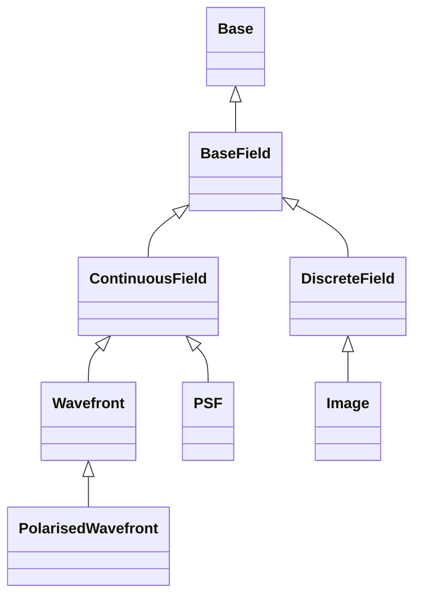

# Fields

## Inheritance

???+ info "BaseField"
    ::: dLux.fields.BaseField

???+ info "ContinuousField"
    ::: dLux.fields.ContinuousField

???+ info "DiscreteField"
    ::: dLux.fields.DiscreteField

???+ info "Wavefront"
    ::: dLux.fields.Wavefront

???+ info "PolarisedWavefront"
    ::: dLux.fields.PolarisedWavefront

???+ info "PSF"
    ::: dLux.fields.PSF

???+ info "Image"
    ::: dLux.fields.Image
