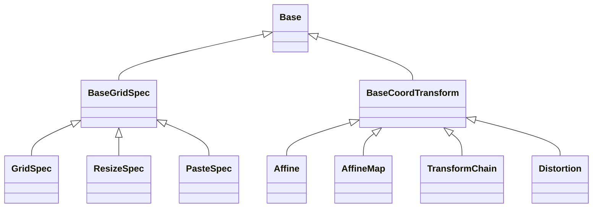

<!-- Generated by docs/scripts/generate_api_mds.py; do not edit. -->

# Grids

## Inheritance

???+ info "BaseGridSpec"
    ::: dLux.grids.BaseGridSpec

???+ info "GridSpec"
    ::: dLux.grids.GridSpec

???+ info "ResizeSpec"
    ::: dLux.grids.ResizeSpec

???+ info "PasteSpec"
    ::: dLux.grids.PasteSpec

???+ info "BaseCoordTransform"
    ::: dLux.grids.BaseCoordTransform

???+ info "Affine"
    ::: dLux.grids.Affine

???+ info "AffineMap"
    ::: dLux.grids.AffineMap

???+ info "TransformChain"
    ::: dLux.grids.TransformChain

???+ info "Distortion"
    ::: dLux.grids.Distortion
