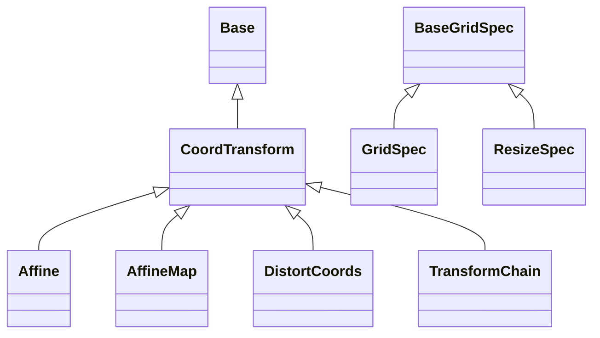

# Grids

## Inheritance

???+ info "GridSpec"
    ::: dLux.grids.GridSpec

???+ info "ResizeSpec"
    ::: dLux.grids.ResizeSpec

???+ info "CoordTransform"
    ::: dLux.grids.CoordTransform

???+ info "Affine"
    ::: dLux.grids.Affine

???+ info "AffineMap"
    ::: dLux.grids.AffineMap

???+ info "TransformChain"
    ::: dLux.grids.TransformChain

???+ info "DistortCoords"
    ::: dLux.grids.DistortCoords
