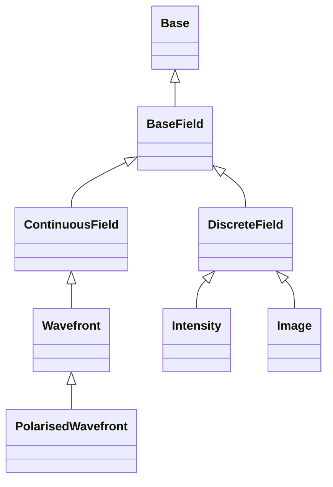
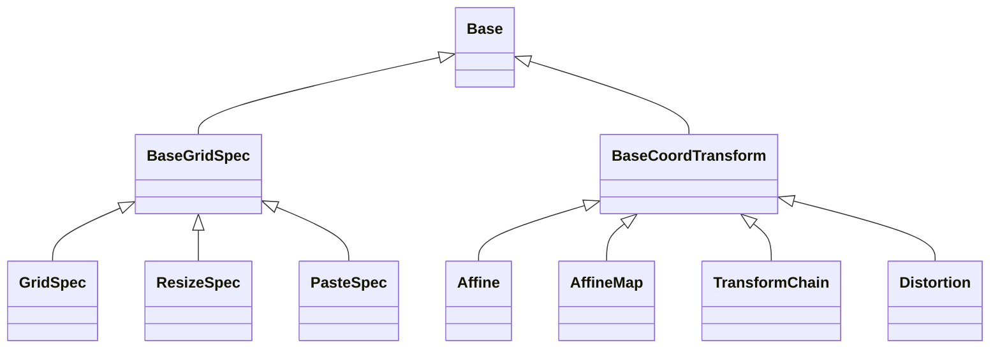
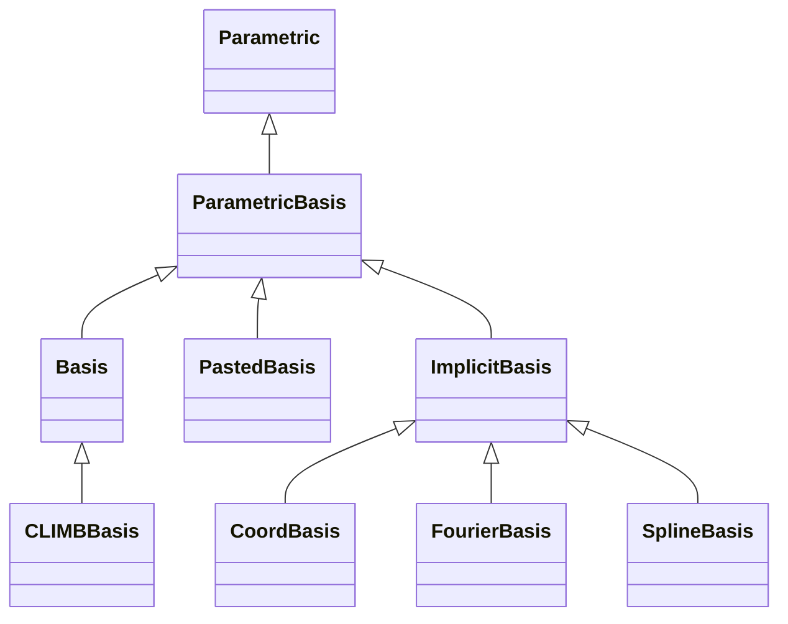
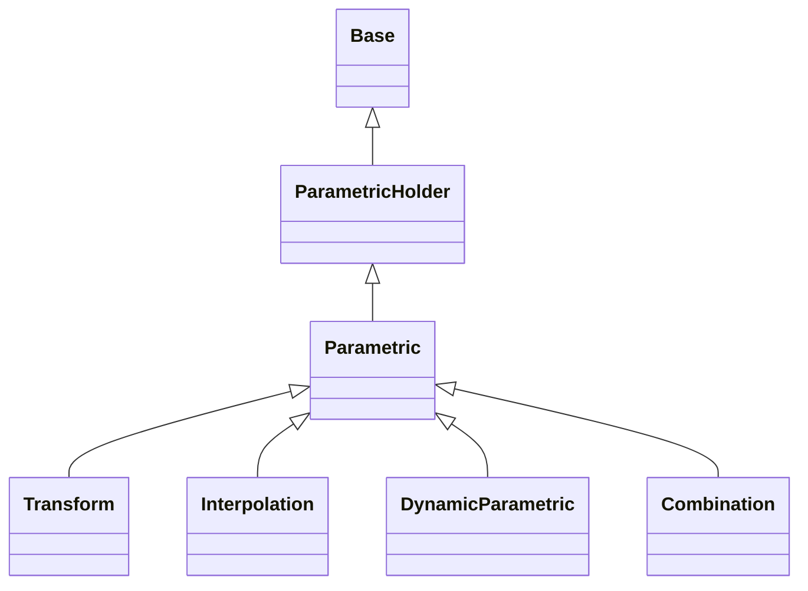
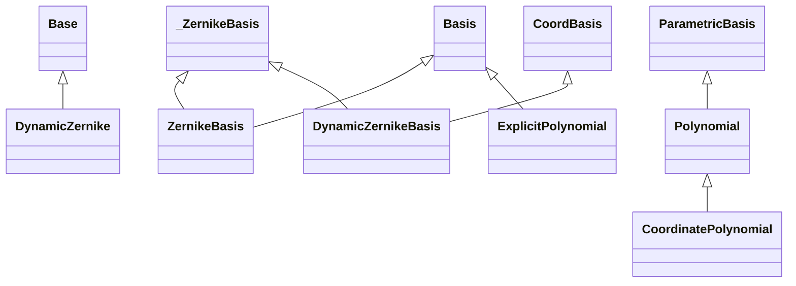
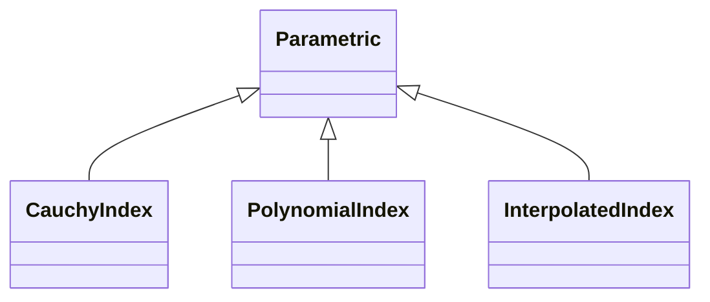
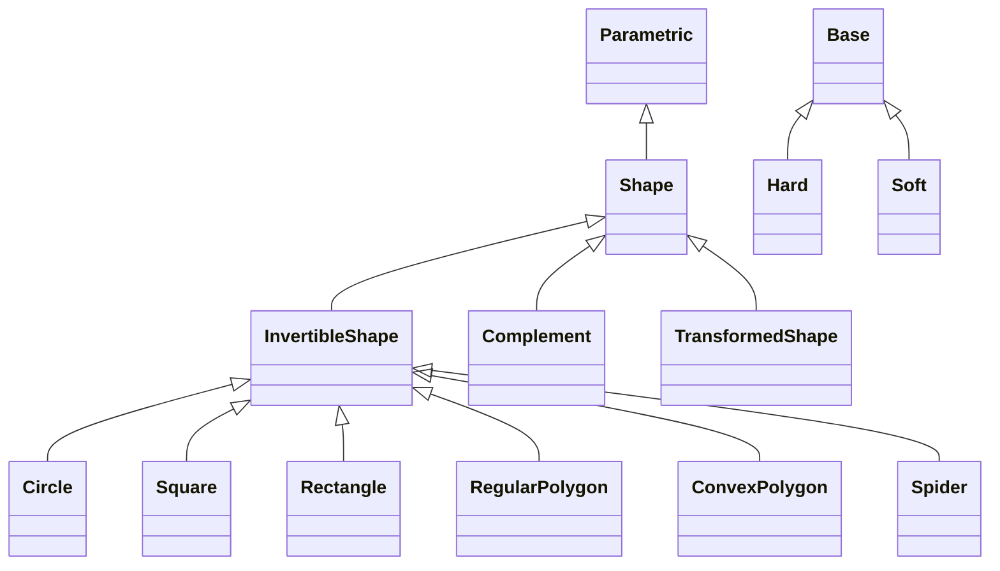
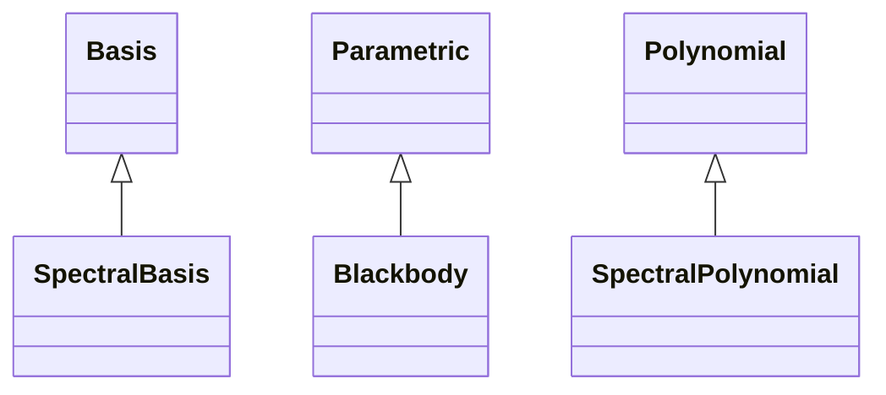
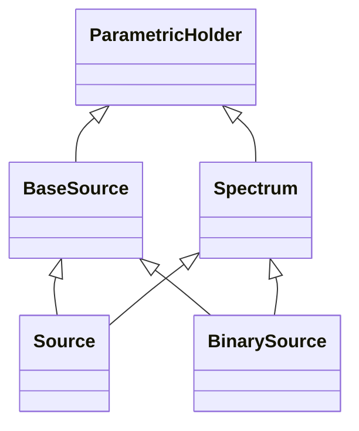
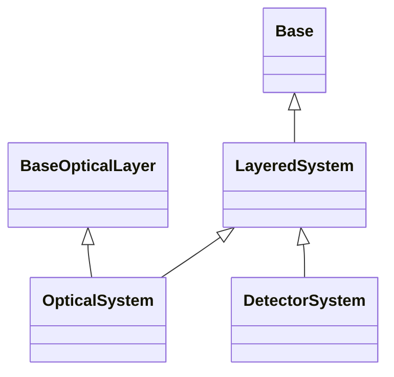

<!-- Generated by docs/scripts/generate_api_mds.py; do not edit. -->

# Core API

These maps are generated from the public API. Each module is shown separately so its complete local structure remains readable. Select a class to open its reference, or follow the module heading for functions and full documentation.

## [Base](base.md)

## [Compatibility](compatibility.md)

Deprecated aliases and migration errors are documented on the compatibility API page. They are omitted from the conceptual class maps because they mirror earlier APIs rather than define the current package structure.

## [Fields](fields.md)

## [Grids](grids.md)

## [Bases](bases.md)

## [Parametrics](parametrics.md)

Functions: [`resolve`](parametrics.md#dLux.parametric.parametrics.resolve).

## [Polynomials](polynomials.md)

## [Refractive](refractive.md)

## [Shapes](shapes.md)

## [Spectral](spectral.md)

## [Sources](sources.md)

## [Systems](systems.md)

