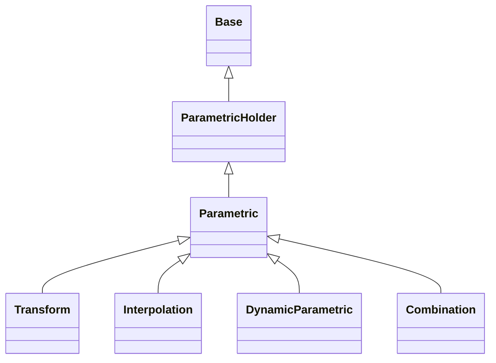

<!-- Generated by docs/scripts/generate_api_mds.py; do not edit. -->

# Parametrics

## Inheritance

???+ info "Parametric"
    ::: dLux.parametric.parametrics.Parametric

???+ info "ParametricHolder"
    ::: dLux.parametric.parametrics.ParametricHolder

???+ info "resolve"
    ::: dLux.parametric.parametrics.resolve

???+ info "Transform"
    ::: dLux.parametric.parametrics.Transform

???+ info "Interpolation"
    ::: dLux.parametric.parametrics.Interpolation

???+ info "DynamicParametric"
    ::: dLux.parametric.parametrics.DynamicParametric

???+ info "Combination"
    ::: dLux.parametric.parametrics.Combination
