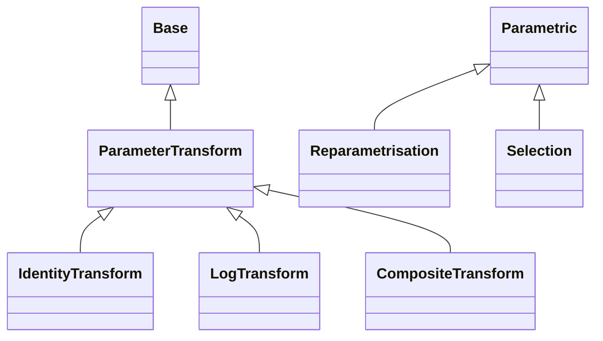

<!-- Generated by docs/scripts/generate_api_mds.py; do not edit. -->

# Parametrisations

## Inheritance

???+ info "ParameterTransform"
    ::: dLux.parametric.parametrisations.ParameterTransform

???+ info "IdentityTransform"
    ::: dLux.parametric.parametrisations.IdentityTransform

???+ info "LogTransform"
    ::: dLux.parametric.parametrisations.LogTransform

???+ info "CompositeTransform"
    ::: dLux.parametric.parametrisations.CompositeTransform

???+ info "Reparametrisation"
    ::: dLux.parametric.parametrisations.Reparametrisation

???+ info "Selection"
    ::: dLux.parametric.parametrisations.Selection
