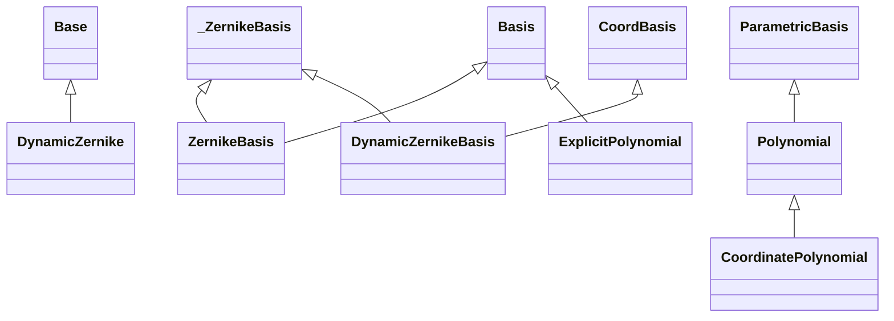

<!-- Generated by docs/scripts/generate_api_mds.py; do not edit. -->

# Polynomials

## Inheritance

???+ info "DynamicZernike"
    ::: dLux.parametric.polynomials.DynamicZernike

???+ info "ZernikeBasis"
    ::: dLux.parametric.polynomials.ZernikeBasis

???+ info "DynamicZernikeBasis"
    ::: dLux.parametric.polynomials.DynamicZernikeBasis

???+ info "Polynomial"
    ::: dLux.parametric.polynomials.Polynomial

???+ info "ExplicitPolynomial"
    ::: dLux.parametric.polynomials.ExplicitPolynomial

???+ info "CoordinatePolynomial"
    ::: dLux.parametric.polynomials.CoordinatePolynomial
