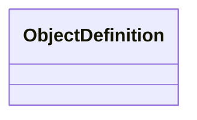

<!-- Generated by docs/scripts/generate_api_mds.py; do not edit. -->

# Serialisation

## Inheritance

???+ info "ObjectDefinition"
    ::: dLux.serialisation.definition.ObjectDefinition

???+ info "save"
    ::: dLux.serialisation.serialisation.save

???+ info "load"
    ::: dLux.serialisation.serialisation.load
