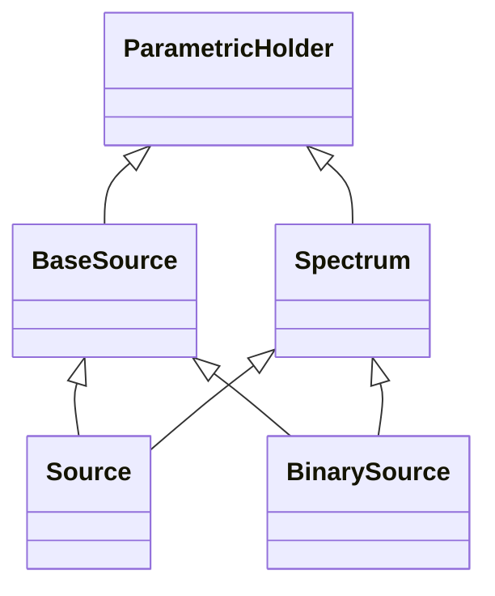

# Sources

## Inheritance

???+ info "BaseSource"
    ::: dLux.sources.BaseSource

???+ info "Spectrum"
    ::: dLux.sources.Spectrum

???+ info "Source"
    ::: dLux.sources.Source

???+ info "BinarySource"
    ::: dLux.sources.BinarySource
