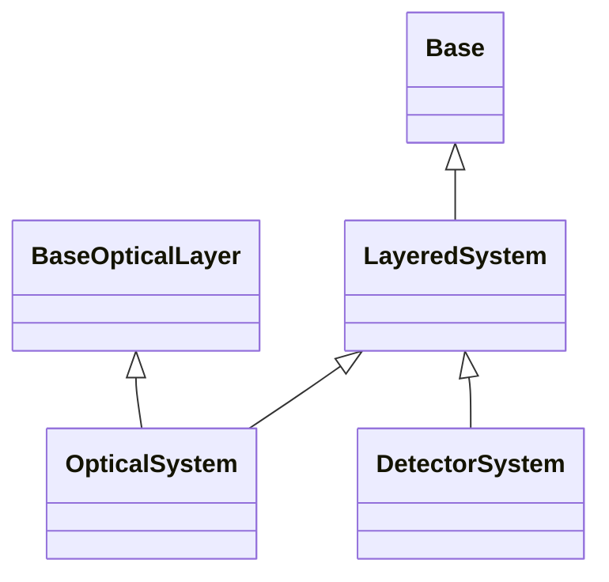

# Systems

## Inheritance

???+ info "LayeredSystem"
    ::: dLux.systems.LayeredSystem

???+ info "OpticalSystem"
    ::: dLux.systems.OpticalSystem

???+ info "DetectorSystem"
    ::: dLux.systems.DetectorSystem

???+ info "Detector"
    ::: dLux.systems.DetectorSystem
