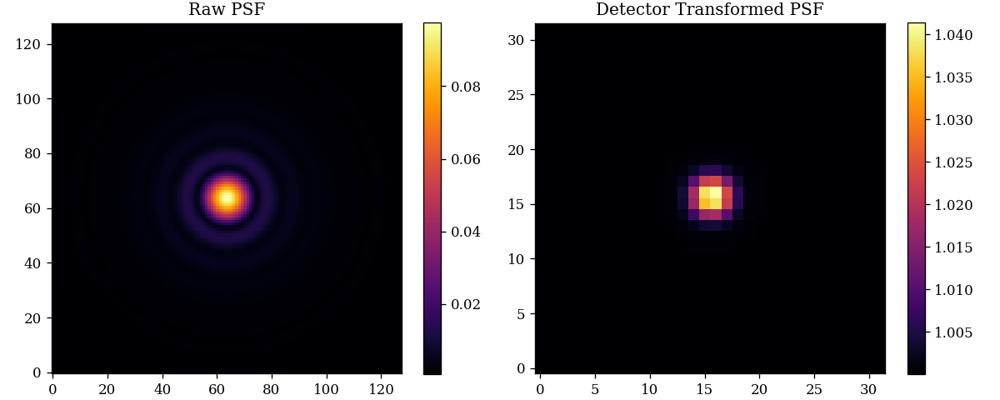

# Detector: detector.py

This module contains the classes that define the behaviour of Detectors in dLux.

There is one public class: `LayeredDetector`.

This essentially operates in the same way as `LayeredOptics`, taking in a list of `DetectorLayers` and applying them sequentially. DetectorLayers operate on `Image` classes. It has one main method, `.model(image)` that applies the detector layers to the input image.

??? info "Detector API"
    ::: dLux.detectors.LayeredDetector

---

# Examples

Lets have a look at how we can construct a `LayeredDetector` class and apply it to some psf.

First we construct some optics and a source:

```python
import jax.numpy as np
import dLux as dl

# Define the optical parameters
wf_npixels = 256
diameter = 1 # meters
psf_npixels = 128
psf_pixel_scale = 0.1 # arcseconds
psf_oversample = 4

# Use ApertureFactory class to make a simple circular aperture
aperture = dl.ApertureFactory(wf_npixels)

# Construct the optics class
optics = dl.AngularOptics(wf_npixels, diameter, aperture, 
    psf_npixels, psf_pixel_scale, psf_oversample)

# Construct Source
wavelengths = np.linspace(1e-6, 1.2e-6, 5) # meters
source = dl.PointSource(wavelengths)
raw_psf = source.model(optics)
```

Now we construct our detector:

```python
# Construct Detector
detector = dl.LayeredDetector([
    dl.ApplyJitter(20),
    dl.IntegerDownsample(4),
    dl.AddConstant(1),
])

# Combine into instrument and model
instrument = dl.Instrument(optics, source, detector)
psf = instrument.model()
```

??? abstract "Plotting Code"
    ```python
    import matplotlib.pyplot as plt
    plt.figure(figsize=(10, 4))
    plt.subplot(1, 2, 1)
    plt.title("Raw PSF")
    plt.imshow(raw_psf**0.5)
    plt.colorbar()

    plt.subplot(1, 2, 2)
    plt.title("Detector Transformed PSF")
    plt.imshow(psf**0.5)
    plt.colorbar()
    plt.savefig('assets/detectors.png')
    ```

