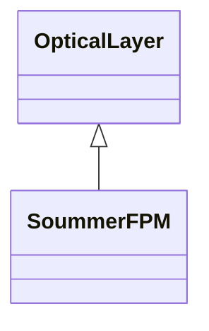

<!-- Generated by docs/scripts/generate_api_mds.py; do not edit. -->

# Coronagraphy

## Inheritance

```mermaid
classDiagram
    class dLux_layers_coronagraphy_SoummerFPM["SoummerFPM"]
    class dLux_layers_optical_OpticalLayer["OpticalLayer"]
    dLux_layers_optical_OpticalLayer <|-- dLux_layers_coronagraphy_SoummerFPM
    click dLux_layers_coronagraphy_SoummerFPM href "#dLux.layers.coronagraphy.SoummerFPM" "Attributes: optic, propagator · Methods: context(), apply_mono()"
```

???+ info "SoummerFPM"
    ::: dLux.layers.coronagraphy.SoummerFPM
