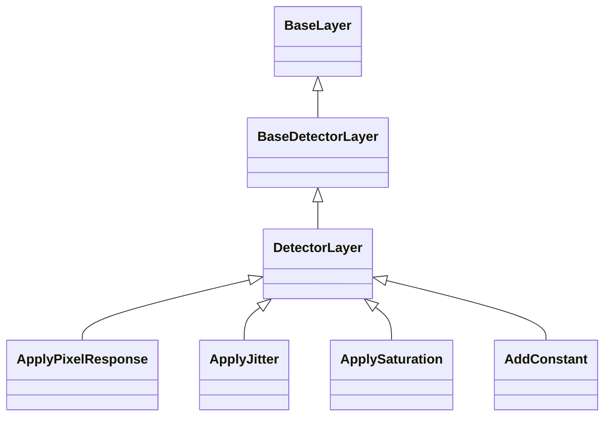

# Detector

## Inheritance

???+ info "BaseDetectorLayer"
    ::: dLux.layers.detector.BaseDetectorLayer

???+ info "DetectorLayer"
    ::: dLux.layers.detector.DetectorLayer

???+ info "ApplyPixelResponse"
    ::: dLux.layers.detector.ApplyPixelResponse

???+ info "ApplyJitter"
    ::: dLux.layers.detector.ApplyJitter

???+ info "ApplySaturation"
    ::: dLux.layers.detector.ApplySaturation

???+ info "AddConstant"
    ::: dLux.layers.detector.AddConstant
