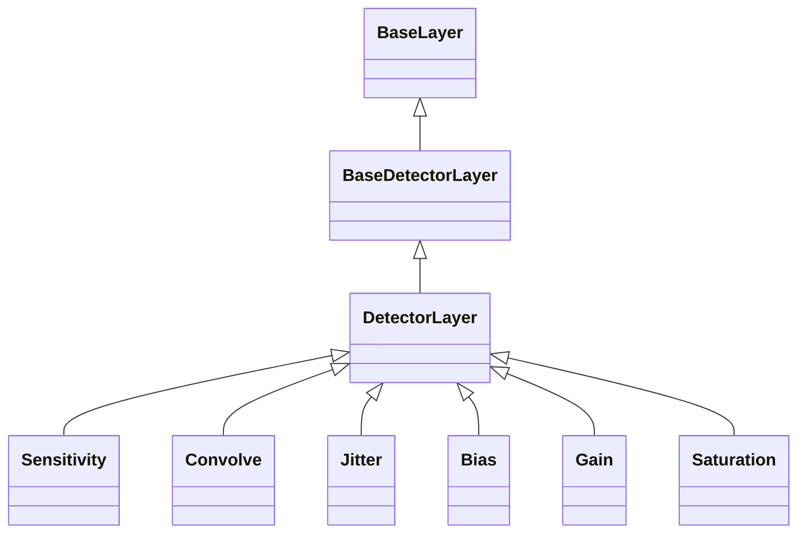

<!-- Generated by docs/scripts/generate_api_mds.py; do not edit. -->

# Detector

## Inheritance

???+ info "BaseDetectorLayer"
    ::: dLux.layers.detector.BaseDetectorLayer

???+ info "DetectorLayer"
    ::: dLux.layers.detector.DetectorLayer

???+ info "Sensitivity"
    ::: dLux.layers.detector.Sensitivity

???+ info "Convolve"
    ::: dLux.layers.detector.Convolve

???+ info "Jitter"
    ::: dLux.layers.detector.Jitter

???+ info "Bias"
    ::: dLux.layers.detector.Bias

???+ info "Gain"
    ::: dLux.layers.detector.Gain

???+ info "Saturation"
    ::: dLux.layers.detector.Saturation
