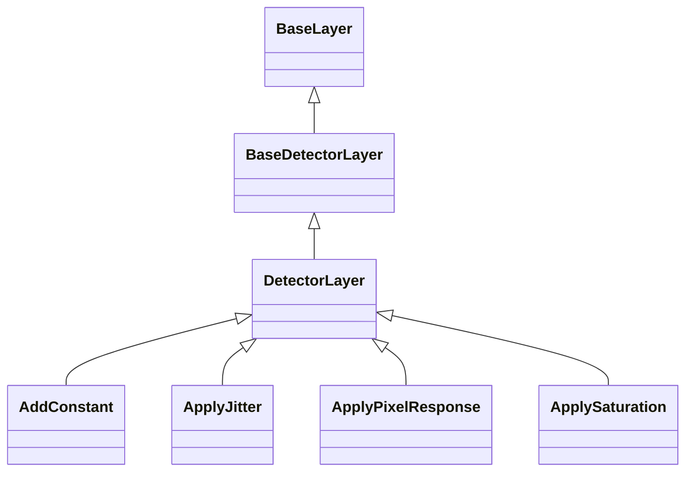

# Detector Layers

## Inheritance

???+ info "BaseDetectorLayer"
    ::: dLux.layers.detector_layers.BaseDetectorLayer

???+ info "DetectorLayer"
    ::: dLux.layers.detector_layers.DetectorLayer

???+ info "ApplyPixelResponse"
    ::: dLux.layers.detector_layers.ApplyPixelResponse

???+ info "ApplyJitter"
    ::: dLux.layers.detector_layers.ApplyJitter

???+ info "ApplySaturation"
    ::: dLux.layers.detector_layers.ApplySaturation

???+ info "AddConstant"
    ::: dLux.layers.detector_layers.AddConstant
