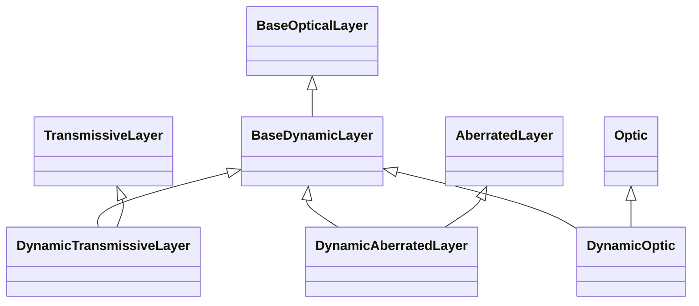

# Dynamic

## Inheritance

???+ info "BaseDynamicLayer"
    ::: dLux.layers.dynamic.BaseDynamicLayer

???+ info "DynamicTransmissiveLayer"
    ::: dLux.layers.dynamic.DynamicTransmissiveLayer

???+ info "DynamicAberratedLayer"
    ::: dLux.layers.dynamic.DynamicAberratedLayer

???+ info "DynamicOptic"
    ::: dLux.layers.dynamic.DynamicOptic
