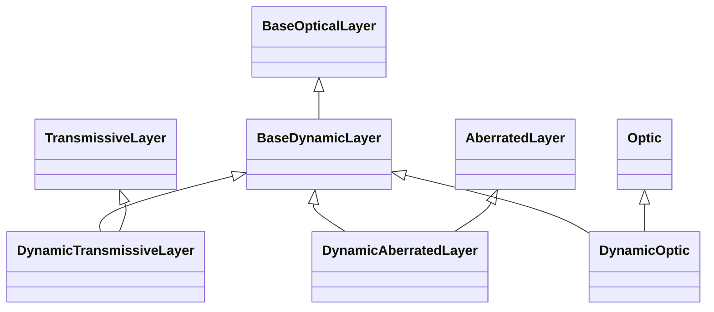

# Dynamic Layers

## Inheritance

???+ info "BaseDynamicLayer"
    ::: dLux.layers.dynamic_layers.BaseDynamicLayer

???+ info "DynamicTransmissiveLayer"
    ::: dLux.layers.dynamic_layers.DynamicTransmissiveLayer

???+ info "DynamicAberratedLayer"
    ::: dLux.layers.dynamic_layers.DynamicAberratedLayer

???+ info "DynamicOptic"
    ::: dLux.layers.dynamic_layers.DynamicOptic
