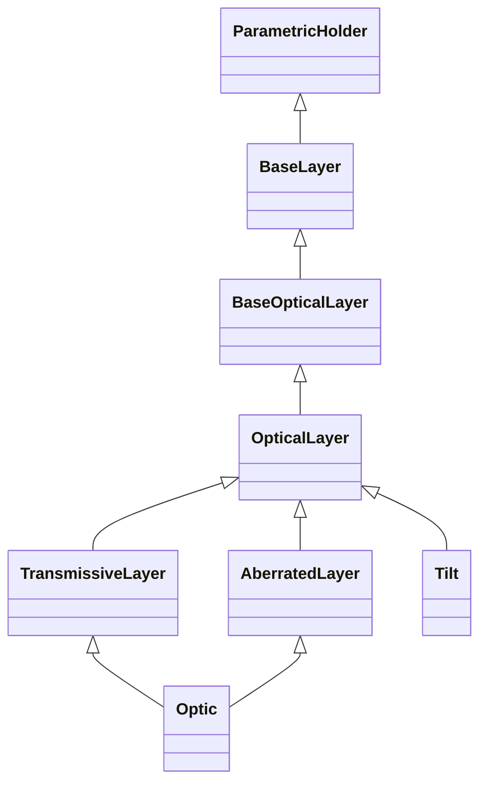

<!-- Generated by docs/scripts/generate_api_mds.py; do not edit. -->

# Optical

## Inheritance

???+ info "BaseLayer"
    ::: dLux.layers.optical.BaseLayer

???+ info "BaseOpticalLayer"
    ::: dLux.layers.optical.BaseOpticalLayer

???+ info "OpticalLayer"
    ::: dLux.layers.optical.OpticalLayer

???+ info "TransmissiveLayer"
    ::: dLux.layers.optical.TransmissiveLayer

???+ info "AberratedLayer"
    ::: dLux.layers.optical.AberratedLayer

???+ info "Optic"
    ::: dLux.layers.optical.Optic

???+ info "Tilt"
    ::: dLux.layers.optical.Tilt
