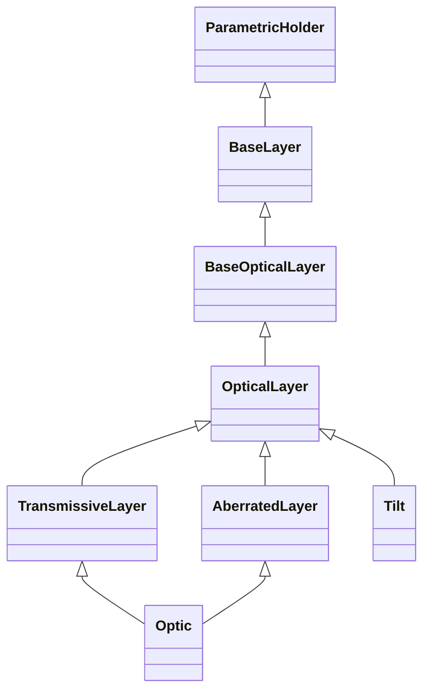

# Optical Layers

## Inheritance

???+ info "BaseLayer"
    ::: dLux.layers.optical_layers.BaseLayer

???+ info "BaseOpticalLayer"
    ::: dLux.layers.optical_layers.BaseOpticalLayer

???+ info "OpticalLayer"
    ::: dLux.layers.optical_layers.OpticalLayer

???+ info "TransmissiveLayer"
    ::: dLux.layers.optical_layers.TransmissiveLayer

???+ info "AberratedLayer"
    ::: dLux.layers.optical_layers.AberratedLayer

???+ info "Optic"
    ::: dLux.layers.optical_layers.Optic

???+ info "Tilt"
    ::: dLux.layers.optical_layers.Tilt
