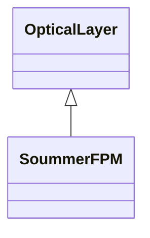
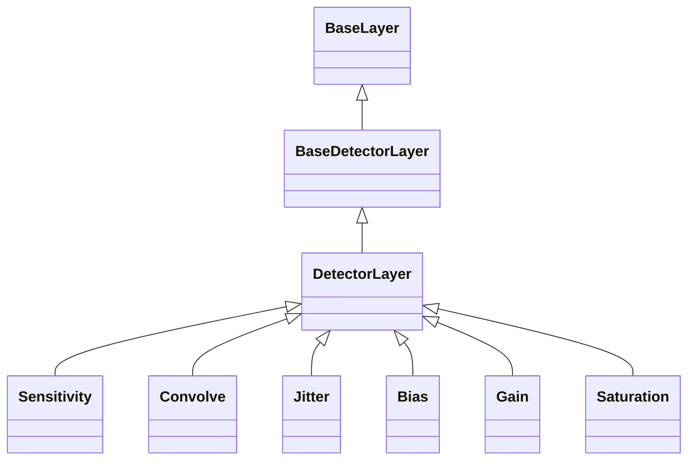
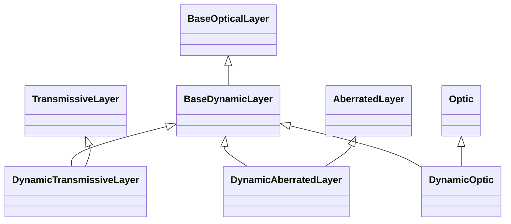
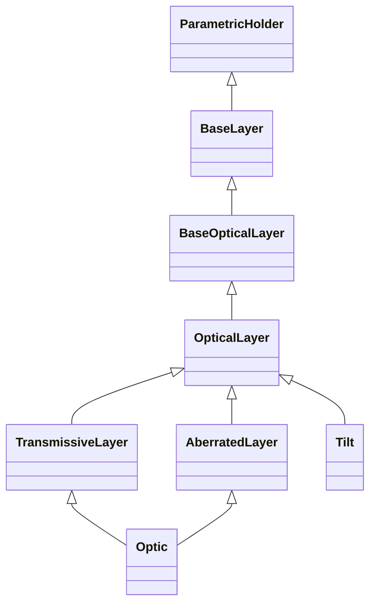
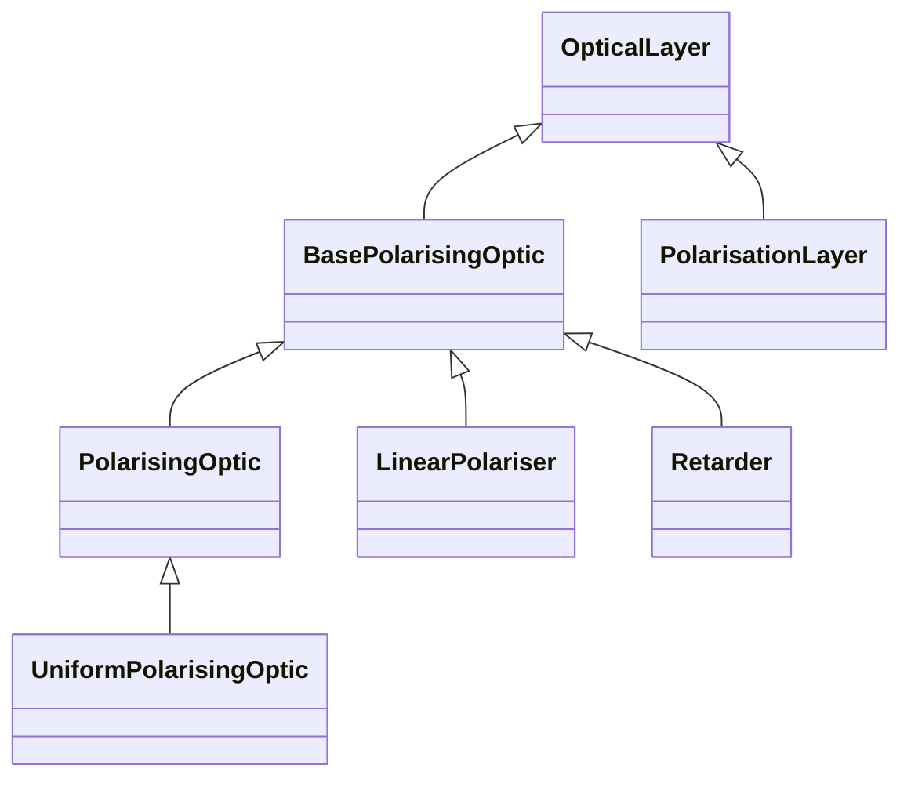
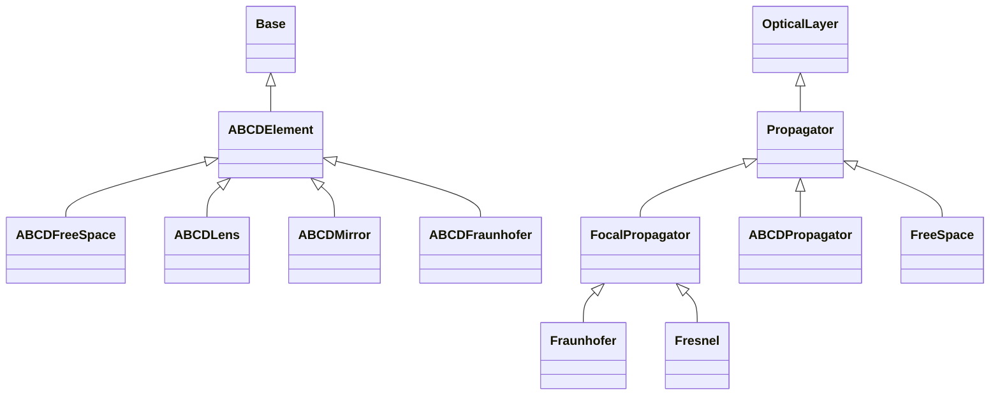
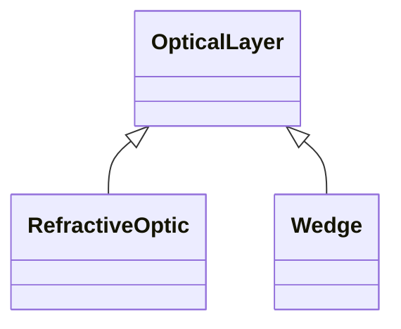
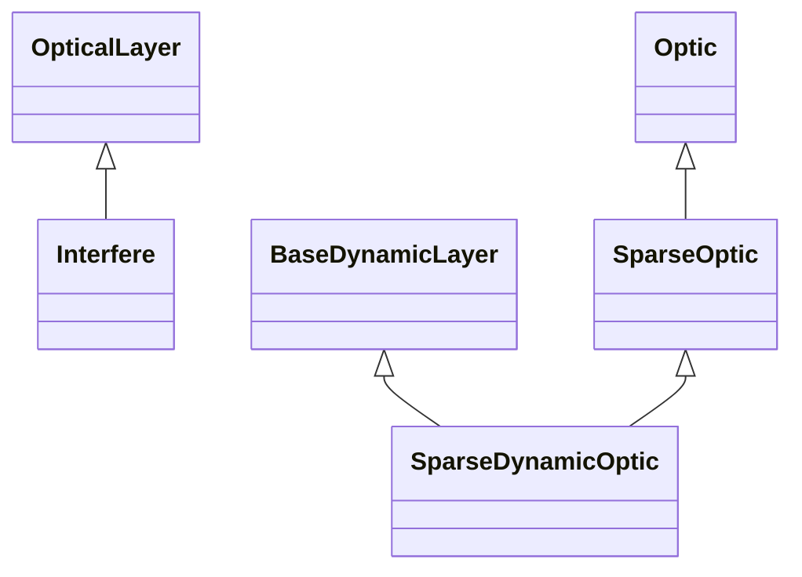
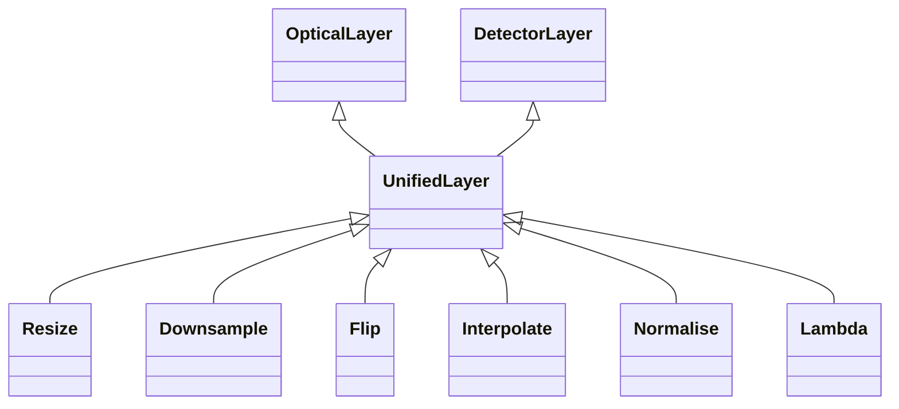

<!-- Generated by docs/scripts/generate_api_mds.py; do not edit. -->

# Layers API

These maps are generated from the public API. Each module is shown separately so its complete local structure remains readable. Select a class to open its reference, or follow the module heading for functions and full documentation.

## [Coronagraphy](coronagraphy.md)

## [Detector](detector.md)

## [Dynamic](dynamic.md)

## [Optical](optical.md)

## [Polarised](polarised.md)

## [Propagation](propagation.md)

## [Refractive](refractive.md)

## [Sparse](sparse.md)

## [Unified](unified.md)

