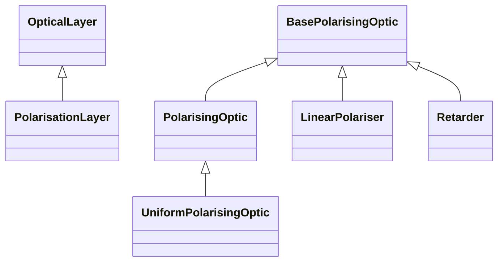

# Polarised

## Inheritance

???+ info "PolarisationLayer"
    ::: dLux.layers.polarised.PolarisationLayer

???+ info "PolarisingOptic"
    ::: dLux.layers.polarised.PolarisingOptic

???+ info "UniformPolarisingOptic"
    ::: dLux.layers.polarised.UniformPolarisingOptic

???+ info "LinearPolariser"
    ::: dLux.layers.polarised.LinearPolariser

???+ info "Retarder"
    ::: dLux.layers.polarised.Retarder
