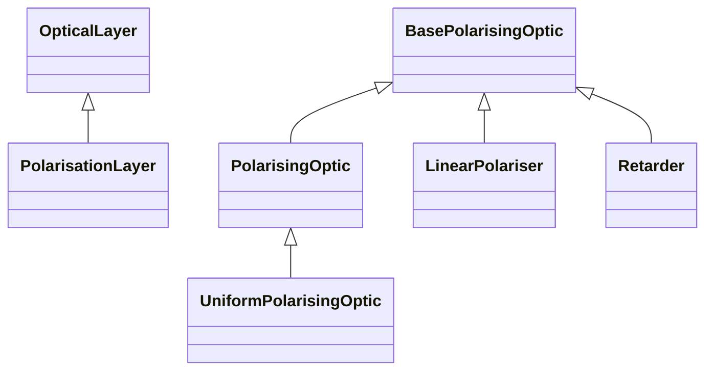

# Polarised Layers

## Inheritance

???+ info "PolarisationLayer"
    ::: dLux.layers.polarised_layers.PolarisationLayer

???+ info "PolarisingOptic"
    ::: dLux.layers.polarised_layers.PolarisingOptic

???+ info "UniformPolarisingOptic"
    ::: dLux.layers.polarised_layers.UniformPolarisingOptic

???+ info "LinearPolariser"
    ::: dLux.layers.polarised_layers.LinearPolariser

???+ info "Retarder"
    ::: dLux.layers.polarised_layers.Retarder
