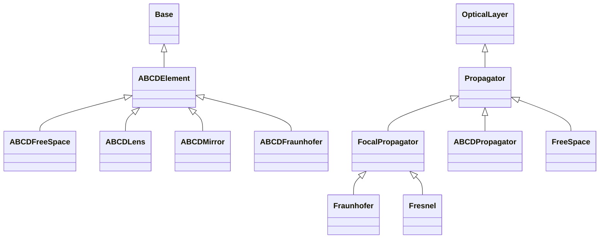

# Propagation

## Inheritance

???+ info "ABCDElement"
    ::: dLux.layers.propagation.ABCDElement

???+ info "ABCDFreeSpace"
    ::: dLux.layers.propagation.ABCDFreeSpace

???+ info "ABCDLens"
    ::: dLux.layers.propagation.ABCDLens

???+ info "ABCDMirror"
    ::: dLux.layers.propagation.ABCDMirror

???+ info "ABCDFraunhofer"
    ::: dLux.layers.propagation.ABCDFraunhofer

???+ info "Propagator"
    ::: dLux.layers.propagation.Propagator

???+ info "FocalPropagator"
    ::: dLux.layers.propagation.FocalPropagator

???+ info "ABCDPropagator"
    ::: dLux.layers.propagation.ABCDPropagator

???+ info "FreeSpace"
    ::: dLux.layers.propagation.FreeSpace

???+ info "Fraunhofer"
    ::: dLux.layers.propagation.Fraunhofer

???+ info "Fresnel"
    ::: dLux.layers.propagation.Fresnel
