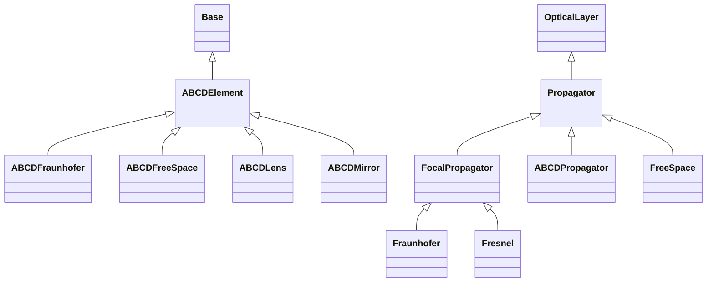

# Propagation Layers

## Inheritance

???+ info "ABCDElement"
    ::: dLux.layers.propagation_layers.ABCDElement

???+ info "ABCDFreeSpace"
    ::: dLux.layers.propagation_layers.ABCDFreeSpace

???+ info "ABCDLens"
    ::: dLux.layers.propagation_layers.ABCDLens

???+ info "ABCDMirror"
    ::: dLux.layers.propagation_layers.ABCDMirror

???+ info "ABCDFraunhofer"
    ::: dLux.layers.propagation_layers.ABCDFraunhofer

???+ info "Propagator"
    ::: dLux.layers.propagation_layers.Propagator

???+ info "FocalPropagator"
    ::: dLux.layers.propagation_layers.FocalPropagator

???+ info "ABCDPropagator"
    ::: dLux.layers.propagation_layers.ABCDPropagator

???+ info "FreeSpace"
    ::: dLux.layers.propagation_layers.FreeSpace

???+ info "Fraunhofer"
    ::: dLux.layers.propagation_layers.Fraunhofer

???+ info "Fresnel"
    ::: dLux.layers.propagation_layers.Fresnel
