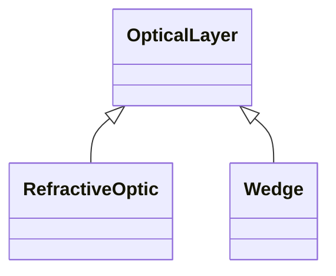

# Refractive

## Inheritance

```mermaid
classDiagram
    class dLux_layers_refractive_RefractiveOptic["RefractiveOptic"]
    class dLux_layers_refractive_Wedge["Wedge"]
    class dLux_layers_optical_OpticalLayer["OpticalLayer"]
    dLux_layers_optical_OpticalLayer <|-- dLux_layers_refractive_RefractiveOptic
    click dLux_layers_refractive_RefractiveOptic href "#dLux.layers.refractive.RefractiveOptic" "Attributes: thickness, n"
    dLux_layers_optical_OpticalLayer <|-- dLux_layers_refractive_Wedge
    click dLux_layers_refractive_Wedge href "#dLux.layers.refractive.Wedge" "Attributes: angle, n"
```

???+ info "RefractiveOptic"
    ::: dLux.layers.refractive.RefractiveOptic

???+ info "Wedge"
    ::: dLux.layers.refractive.Wedge
