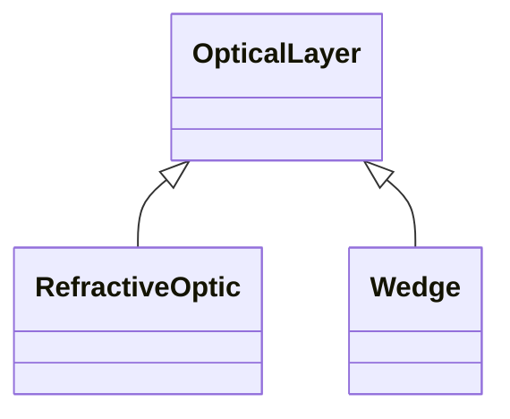

# Refractive Layers

## Inheritance

```mermaid
classDiagram
    class dLux_layers_refractive_layers_RefractiveOptic["RefractiveOptic"]
    class dLux_layers_refractive_layers_Wedge["Wedge"]
    class dLux_layers_optical_layers_OpticalLayer["OpticalLayer"]
    dLux_layers_optical_layers_OpticalLayer <|-- dLux_layers_refractive_layers_RefractiveOptic
    click dLux_layers_refractive_layers_RefractiveOptic href "#dLux.layers.refractive_layers.RefractiveOptic" "Attributes: thickness, n"
    dLux_layers_optical_layers_OpticalLayer <|-- dLux_layers_refractive_layers_Wedge
    click dLux_layers_refractive_layers_Wedge href "#dLux.layers.refractive_layers.Wedge" "Attributes: angle, n"
```

???+ info "RefractiveOptic"
    ::: dLux.layers.refractive_layers.RefractiveOptic

???+ info "Wedge"
    ::: dLux.layers.refractive_layers.Wedge
