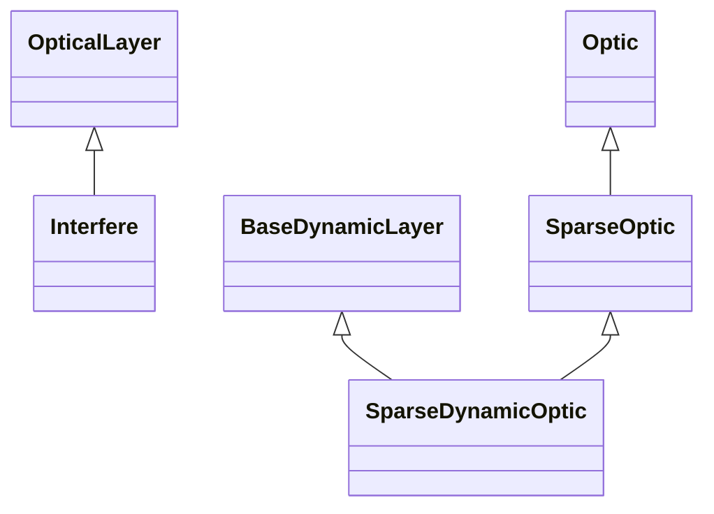

# Sparse

## Inheritance

???+ info "Interfere"
    ::: dLux.layers.sparse.Interfere

???+ info "SparseOptic"
    ::: dLux.layers.sparse.SparseOptic

???+ info "SparseDynamicOptic"
    ::: dLux.layers.sparse.SparseDynamicOptic
