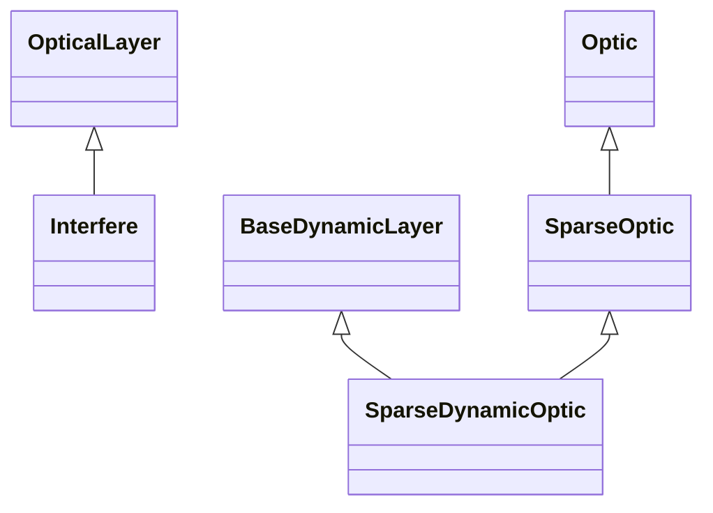

# Sparse Layers

## Inheritance

???+ info "Interfere"
    ::: dLux.layers.sparse_layers.Interfere

???+ info "SparseOptic"
    ::: dLux.layers.sparse_layers.SparseOptic

???+ info "SparseDynamicOptic"
    ::: dLux.layers.sparse_layers.SparseDynamicOptic
