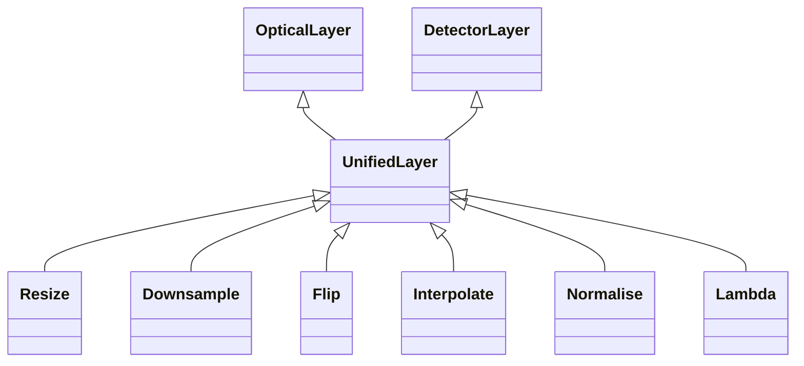

<!-- Generated by docs/scripts/generate_api_mds.py; do not edit. -->

# Unified

## Inheritance

???+ info "UnifiedLayer"
    ::: dLux.layers.unified.UnifiedLayer

???+ info "Resize"
    ::: dLux.layers.unified.Resize

???+ info "Downsample"
    ::: dLux.layers.unified.Downsample

???+ info "Flip"
    ::: dLux.layers.unified.Flip

???+ info "Interpolate"
    ::: dLux.layers.unified.Interpolate

???+ info "Normalise"
    ::: dLux.layers.unified.Normalise

???+ info "Lambda"
    ::: dLux.layers.unified.Lambda
