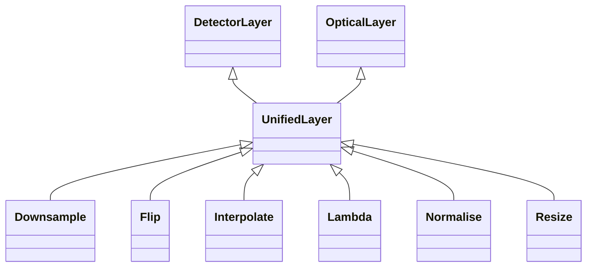

# Unified Layers

## Inheritance

???+ info "UnifiedLayer"
    ::: dLux.layers.unified_layers.UnifiedLayer

???+ info "Resize"
    ::: dLux.layers.unified_layers.Resize

???+ info "Downsample"
    ::: dLux.layers.unified_layers.Downsample

???+ info "Flip"
    ::: dLux.layers.unified_layers.Flip

???+ info "Interpolate"
    ::: dLux.layers.unified_layers.Interpolate

???+ info "Normalise"
    ::: dLux.layers.unified_layers.Normalise

???+ info "Lambda"
    ::: dLux.layers.unified_layers.Lambda
