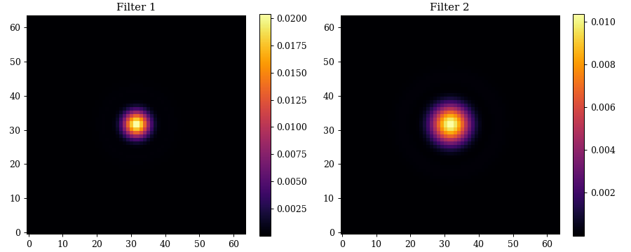

# Observations

The observations class is designed to give users complete control over how the instrument is modelled. It is designed to be used in conjunction with the `Instrument` class and stored as one of its class attributes. There is one main class `AbstractObservation` that is designed to be subclassed. Users can create custom observations by inheriting from `AbstractObservation` and implementing the `observe` method. Lets take a look at an example observation class. Lets say we wanted to model the response of some instrument over two different band-passes. We could do this by creating a custom observation class:

```python
import dLux as dl
from jax import Array, numpy as np

class TwoFilterObservation(dl.AbstractObservation):
    filter1 : Array
    filter2 : Array

    def __init__(self, filter1, filter2):
        """Constructs the observation class"""
        super().__init__(name='TwoFilterObservation')
        self.filter1 = np.asarray(filter1, dtype=float)
        self.filter2 = np.asarray(filter2, dtype=float)

    def observe(self, instrument):
        """Models the instrument over two different band-passes"""

        # Model first PSF
        instrument = instrument.set('PointSource.wavelengths', self.filter1)
        psf1 = instrument.model()

        # Model second PSF
        instrument = instrument.set('PointSource.wavelengths', self.filter2)
        psf2 = instrument.model()

        return psf1, psf2

filter1 = 1e-6 * np.linspace(1., 1.5, 10)
filter2 = 1e-6 * np.linspace(1.5, 2., 10)
observation = TwoFilterObservation(filter1, filter2)
```

We then load this into the instrument class:

```python
# Define the parameters of the optical system
aperture_diameter = 1.0  # meters
pixel_scale       = 2e-7 # Radians per pixel of the detector
aperture_npixels  = 256  # Number of pixels representing the wavefront
detector_npixels  = 64   # Number of pixels in the detector

# Define a simple optical system
layers = [
    dl.CreateWavefront(aperture_npixels, aperture_diameter),
    dl.ApertureFactory(aperture_npixels, name='Aperture'),
    dl.NormaliseWavefront(),
    dl.AngularMFT(detector_npixels, pixel_scale, name='Propagator'),
]

# Create the Optics object
optics = dl.Optics(layers)

# Create a Point Source
source = dl.PointSource(wavelengths=filter1)

# Create the Telescope object
telescope = dl.Instrument(optics, source, observation=observation)

# Models the two PSFs
psf1, psf2 = telescope.observe()
```

??? abstract "Plotting code"
    ```python
    import matplotlib.pyplot as plt

    plt.figure(figsize=(10, 4))
    plt.subplot(1, 2, 1)
    plt.title("Filter 1")
    plt.imshow(psf1)
    plt.colorbar()

    plt.subplot(1, 2, 2)
    plt.title("Filter 2")
    plt.imshow(psf2)
    plt.colorbar()
    plt.tight_layout()
    plt.savefig("assets/observation.png")
    ```



This is a relatively simple example, but shows the flexibilty that can be gained with this class! It can also be used to remove redunancies in calcualtions. Say you wanted to model multiple sources through the same instrument that are separated by a large on-sky angle that still fall on detector, rather than model the full array we can model only the regions that we care about in order to save a lot of redundant compute!

!!! tip "Acessing Parameters"
    The `AbstractObservation` class has a built in `__getattr__` class that allows for its parameters to be accessed from high level classes like `Instrument`. That means if we wanted to access the `filter1` parameter we could do so like this:
    
    ```python
    filt = telescope.filter1
    ```

    As opposed to the longer:

    ```python
    filt = telescope.observation.filter1
    ```

## Abstract Observation

The base class that all user-created observations should inherit from.

??? info "Abstract Observation API"
    ::: dLux.observations.AbstractObservation

## Dither

A simple dither observation class that models the instrument over a grid of relative pointings.

??? info "Dither API"
    ::: dLux.observations.Dither