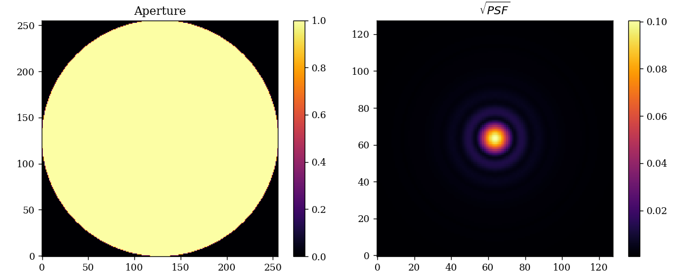
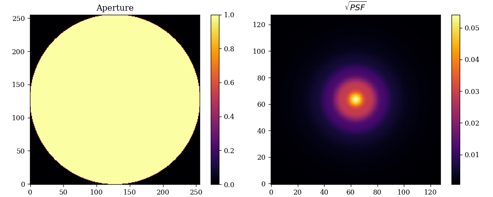
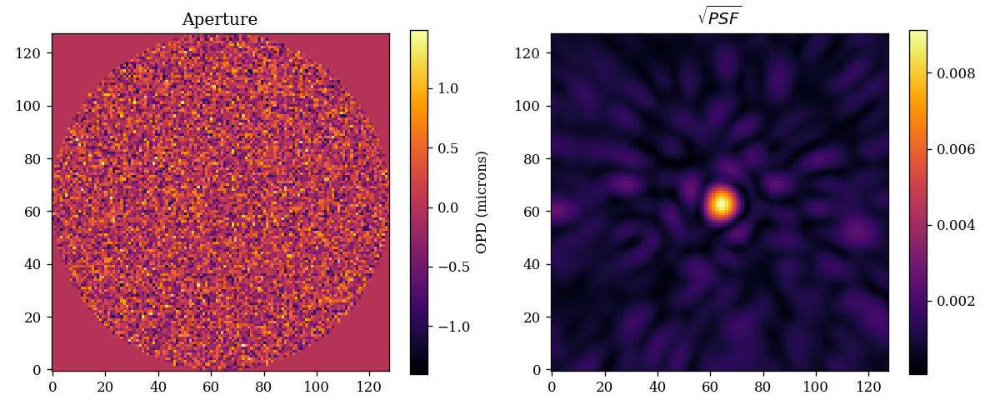

# Optical Systems: `optics.py`

This module contains the classes that define the behaviour of optical systems in ∂Lux. The classes are designed to be as flexible as possible, allowing users to easily create their own optical systems.

There are four public classes:

- `AngularOptics`
- `CartesianOptics`
- `FlexibleOptics`
- `LayeredOptics`

Optics classes store `OpticalLayers` that operate on `Wavefronts`.

There are two types of optics classes: _Layered_ and _non-Layered_. Layered optics classes take in a list of `OpticalLayers` and apply them sequentially to the wavefront, giving users full control and flexibility in the modelling of their optical system.

Non-Layered optics classes are designed to be simple and easy to use, taking in few parameters that define the behaviour of a common optical system. We will explore these further in the Examples section below.

All public optics classes have three main methods:

1. `model(sources)` Models ∂Lux `Source` objects through the optics.
2. `propagate(wavelengths, offset, weights)` Models a polychromatic point source through the optics.
3. `propagate_mono(wavelength, offset)` Propagates a monochromatic point source through the optics.

The `propagate_mono` method is where the actual wavefront propagation through the optics occurs, but `propagate` vectorises the calculations across wavelengths for efficiency.

---

# Examples

We will start here with the non-layered optics classes as they are simpler.

## AngularOptics

??? info "Angular Optics API"
    :::dLux.optics.AngularOptics

To construct an `AngularOptics` class we need to define five things:

1. The number of pixels of the initial wavefront
2. The diameter of the initial wavefront
3. The aperture of the system
4. The number of pixels of the final PSF
5. The pixel scale of the final PSF

!!! tip "Units"
    Most code in ∂Lux is written in SI units, but this class breaks from this convention, with `psf_pixel_scale` taken in units of arcseconds.

!!! tip "Apertures"
    The `aperture` parameter can also be supplied as an array, where it will treated as an array of transmission values!

The following code snippet shows how to construct a simple angular optical system and
propagate a point source through it.

```python
import jax.numpy as np
import dLux as dl

# Define the parameters
wf_npixels = 256
diameter = 1 # metres
psf_npixels = 128
psf_pixel_scale = 0.1 # arcseconds
psf_oversample = 4

# Use ApertureFactory class to make a simple circular aperture
aperture = dl.ApertureFactory(wf_npixels)

# Construct the optics class
optics = dl.AngularOptics(wf_npixels, diameter, aperture, 
    psf_npixels, psf_pixel_scale, psf_oversample)

# Propagate the wavelengths
wavelengths = np.linspace(1e-6, 1.2e-6, 5) # metres
psf = optics.propagate(wavelengths)
```

??? abstract "Plotting code"
    ```python
    import matplotlib.pyplot as plt
    plt.figure(figsize=(10, 4))
    plt.subplot(1, 2, 1)
    plt.title("Aperture")
    plt.imshow(optics.aperture.transmission)
    plt.colorbar()

    plt.subplot(1, 2, 2)
    plt.title("$\sqrt{PSF}$")
    plt.imshow(psf**0.5)
    plt.colorbar()
    plt.savefig('angular_psf.png')
    ```


---

## CartesianOptics

The `CartesianOptics` class is very similar to the `AngularOptics` class, but it also takes in a focal length, and the units of `psf_pixel_scale` are microns.

??? info "Cartesian Optics API"
    :::dLux.optics.CartesianOptics

The following code snippet shows how to construct a simple Cartesian optical system and propagate a point source through it.

```python
import jax.numpy as np
import dLux as dl

# Define the parameters
wf_npixels = 256
diameter = 1 # metres
focal_length = 2 # metres
psf_npixels = 128
psf_pixel_scale = 1 # microns
psf_oversample = 4

# Use ApertureFactory class to make a simple circular aperture
aperture = dl.ApertureFactory(wf_npixels)

# Construct the optics class
optics = dl.CartesianOptics(wf_npixels, diameter, aperture, focal_length,
    psf_npixels, psf_pixel_scale, psf_oversample)

# Propagate the wavelengths
wavelengths = np.linspace(1e-6, 1.2e-6, 5) # metres
psf = optics.propagate(wavelengths)
```

??? abstract "Plotting Code"
    ```python
    import matplotlib.pyplot as plt
    plt.figure(figsize=(10, 4))
    plt.subplot(1, 2, 1)
    plt.title("Aperture")
    plt.imshow(optics.aperture.transmission)
    plt.colorbar()

    plt.subplot(1, 2, 2)
    plt.title("$\sqrt{PSF}$")
    plt.imshow(psf**0.5)
    plt.colorbar()
    plt.savefig('cartesian_psf.png')
    ```



---

## FlexibleOptics

The `FlexibleOptics` class allows for the use of any `Propagator` class in ∂Lux. Let's have a look at how we can use this propagator to model a PSF with a Fresnel defocus.

??? info "Flexible Optics API"
    :::dLux.optics.FlexibleOptics

```python
import jax.numpy as np
import dLux as dl

# Define the parameters
wf_npixels = 256
diameter = 1 # metres
focal_length = 2 # metres
psf_npixels = 128
psf_pixel_scale = 0.25e-6 # metres
focal_shift = 2e-5 # metres

# Use ApertureFactory class to make a simple circular aperture
aperture = dl.ApertureFactory(wf_npixels)

# Construct a Fresnel Propagator
propagator = dl.FarFieldFresnel(psf_npixels, psf_pixel_scale, focal_length,
    focal_shift)

# Construct the optics class
optics = dl.FlexibleOptics(wf_npixels, diameter, aperture, propagator)

# Propagate the wavelengths
wavelengths = np.linspace(1e-6, 1.2e-6, 5) # metres
psf = optics.propagate(wavelengths)
```

??? abstract "Plotting code"
    ```python
    import matplotlib.pyplot as plt
    plt.figure(figsize=(10, 4))
    plt.subplot(1, 2, 1)
    plt.title("Aperture")
    plt.imshow(optics.aperture.transmission)
    plt.colorbar()

    plt.subplot(1, 2, 2)
    plt.title("$\sqrt{PSF}$")
    plt.imshow(psf**0.5)
    plt.colorbar()
    plt.savefig('fresnel_psf.png')
    ```



---

## LayeredOptics

The `LayeredOptics` class allows us to define a list of `OpticalLayers` that operate on a wavefront. This allows us to model more complex optical systems than the previous classes, while also allowing users to define their own `OpticalLayers`! Look at the `OpticalLayers` documentation for more information.

??? info "Layered Optics API"
    :::dLux.optics.LayeredOptics

Let's have a look at how we can use this class to model a simple optical system.

```python
import jax.numpy as np
import dLux as dl

# Define the parameters
wf_npixels = 256
diameter = 1 # metres
focal_length = 2 # metres
psf_npixels = 128
psf_pixel_scale = 0.25e-6 # metres

# Construct the list of optical layers
layers = [
    (dl.ApertureFactory(wf_npixels), 'aperture'),
    dl.MFT(psf_npixels, psf_pixel_scale, focal_length),
]

# Construct the optics class
optics = dl.LayeredOptics(wf_npixels, diameter, layers)

# Propagate the wavelengths
wavelengths = np.linspace(1e-6, 1.2e-6, 5) # metres
psf = optics.propagate(wavelengths)
```

!!! tip "Accessing Layers"
    Note that we can pass in a tuple of the form (OpticalLayer, key) to the LayeredOptics class. OpticalLayers and transformed into an OrderedDict and this key is then used for that layer. This allows us to access the layers in the class via the `class.attribute` method, i.e. `optics.aperture`. This can be very helpful when using Zodiax methods!

??? abstract "Plotting code"
    ```python
    import matplotlib.pyplot as plt
    plt.figure(figsize=(10, 4))
    plt.subplot(1, 2, 1)
    plt.title("Aperture")
    plt.imshow(optics.aperture.transmission)
    plt.colorbar()

    plt.subplot(1, 2, 2)
    plt.title("$\sqrt{PSF}$")
    plt.imshow(psf**0.5)
    plt.colorbar()
    plt.savefig('layered_psf.png')
    ```


---

# Building your own Optical System

[comment]: <> (TODO: Add link to dLuxJWST repos)

It can often be helpful to create your own Optical System class to provide a more complex optical models. For example, the dLuxJWST and [dLuxToliman](https://github.com/maxecharles/dLuxToliman) repos built by the ∂Lux devs! ∂Lux is designed to facilitate this, requiring users to only implement two methods in order to have a class that entirely integrates with the wider ∂Lux ecosystem.

Note: ∂Lux is built in [Zodiax](https://github.com/LouisDesdoigts/zodiax). If you are unfamiliar, you should read [this tutorial](https://louisdesdoigts.github.io/zodiax/docs/usage/) before this example.

Let's have a look at how we can create a simple optical system from the ground up, using a pixel scale in units of arcseconds and a transmissive mask. To do this, we need to implement both the `__init__` and `propagate_mono` methods. It will have six attributes: `wf_npixels`, `diameter`, `aperture`, `mask`, `psf_pixel_scale`, `psf_npixels`.

```python
from jax import Array
import dLux.utils as dlu
import dLux

# We must inherit from the base optics class, `BaseOptics`. This will integrate
# our class with the rest of the dLux code.
class MyOptics(dLux.optics.BaseOptics):
    wf_npixels      : int
    diameter        : float
    aperture        : Array
    mask            : Array
    psf_pixel_scale : float
    psf_npixels     : int

    def __init__(self, wf_npixes, diameter, aperture, mask, psf_npixels, 
        psf_pixel_scale):
        '''Constructs the class'''
        self.wf_npixels = wf_npixels
        self.diameter = diameter
        self.aperture = aperture
        self.mask = mask
        self.psf_npixels = psf_npixels
        self.psf_pixel_scale = psf_pixel_scale
    
    # Our propagate_mono must have the expected behaviour of dLux optics,
    # meaning it must take the same inputs (wavelength, offset, return_wf) and
    # return the same outputs (psf).
    def propagate_mono(self, wavelength, offset=np.zeros(2), return_wf=False):
        '''Propagates a monochromatic source'''

        # Construct our wavefront
        wf = dLux.Wavefront(self.wf_npixels, self.diameter, wavelength)

        # Tilt the wavefront
        wf = wf.tilt(offset)

        # We can use the `self` keyword to access the class attributes
        wf *= self.aperture

        # Normalise the wavefront
        wf = wf.normalise()

        # Apply the mask as an array of OPDs
        wf += self.mask

        # Propagate the wavefront, casting the units of pixel scale to radians
        pixel_scale = dlu.arcmin_to_rad(self.psf_pixel_scale)
        wf = wf.MFT(self.psf_npixels, pixel_scale)

        # Return the PSF
        if return_wf:
            return wf
        else:
            return wf.psf
```

!!! tip "Applying Optical Layers"
    We can apply `OpticalLayer` and arrays to wavefronts using the `*=` operator. This is equivalent to `wf = layer(wf)`.

Now we can use this optical system as per usual! This class will now be recognised by all ∂Lux functions that take in an optics class, such as `Sources` and `Instruments`.

```python
import jax.numpy as np
import jax.random as jr
import dLux as dl

# Define the parameters
wf_npixels = 128
diameter = 1 # metres
psf_npixels = 128
psf_pixel_scale = 5e-4 # arcminutes

# Use ApertureFactory class to make a simple circular aperture
aperture = dl.ApertureFactory(wf_npixels)

# Make a mask of random OPDs
mask = 4.e-7 * jr.normal(jr.PRNGKey(0), (wf_npixels, wf_npixels))

# Construct the optics class
optics = MyOptics(wf_npixels, diameter, aperture, mask, psf_npixels, 
    psf_pixel_scale)

# Propagate the wavelengths
wavelengths = np.linspace(1e-6, 1.2e-6, 5) # metres
psf = optics.propagate(wavelengths)
```

??? abstract "Plotting code"
    ```python
    import matplotlib.pyplot as plt
    plt.figure(figsize=(10, 4))
    plt.subplot(1, 2, 1)
    plt.title("Aperture")
    plt.imshow(optics.aperture.transmission)
    plt.colorbar()

    plt.subplot(1, 2, 2)
    plt.title("$\sqrt{PSF}$")
    plt.imshow(psf**0.5)
    plt.colorbar()
    plt.savefig('my_optics_psf.png')
    ```



---

## Private classes

[comment]: <> (source code?)

To further facilitate the creation of custom optics classes, ∂Lux provides a few base classes that can be used to build your own optics classes.

The private classes are as follows:

- `BaseOptics`
- `SimpleOptics`
- `NonPropagatorOptics`
- `AperturedOptics`

These classes are not intended to be used directly, but rather to be inherited from and extended. Let's look at them one by one.

The `BaseOptics` class is the base class for all optics classes in ∂Lux, so if you inherit from `SimpleOptics`,`NonPropagatorOptics`, or `AperturedOptics`, you will automatically inherit from `BaseOptics`. It implements the `model` and `propagate` methods, and defines the `propagate_mono` method as an abstract method. This means that any class that inherits from `BaseOptics` must implement a `propagate_mono` method with the same signature as the abstract method. This is the only requirement for a class to be recognised as an optics class by ∂Lux.

The `SimpleOptics` class adds the `wf_npixels` and `diameter` attributes, and adds a single method: `_construct_wavefront(wavelength, offset)`, which constructs a wavefront of the correct size and width and performs the initial tilt from the `offset` value.

The `NonPropagatorOptics` class adds the `psf_npixels`, `psf_pixel_scale`, and `psf_oversample` attributes, along with a `true_pixel_scale`.

The `AperturedOptics` class adds the `aperture` and `mask` attributes, along with an `_apply_aperture(wavelength, offset)` method that applies the aperture and mask to the wavefront, calling the `_construct_wavefront` method under the hood. Note that by default, the `mask` attribute is applied as a transmissive mask if it supplied as an array.