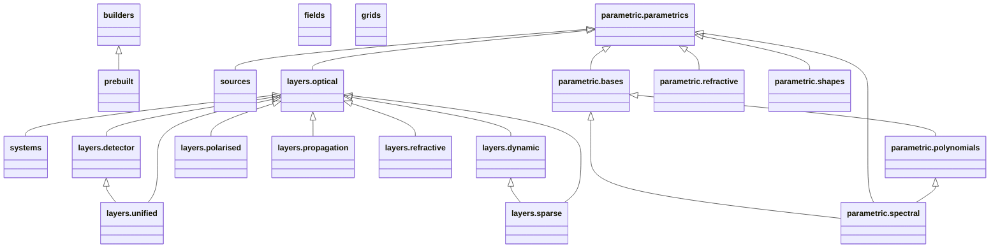

# API

This package map is generated from cross-module inheritance in the public API. Hover over a module to see its public classes, or select it to open its reference.

```mermaid
classDiagram
    class dLux_builders["builders"]
    click dLux_builders href "../core/builders/" "Public classes: GridBuilder, OPDDef, ApertureData, Norm, ZernikeDef, ApertureBuilder, SparseApertureBuilder"
    class dLux_fields["fields"]
    click dLux_fields href "../core/fields/" "Public classes: BaseField, ContinuousField, DiscreteField, Wavefront, PolarisedWavefront, PSF, Image"
    class dLux_grids["grids"]
    click dLux_grids href "../core/grids/" "Public classes: GridSpec, ResizeSpec, CoordTransform, Affine, AffineMap, TransformChain, DistortCoords"
    class dLux_prebuilt["prebuilt"]
    click dLux_prebuilt href "../core/prebuilt/" "Public classes: SimpleCircular, SegmentedHex, NRMLike, HSTLike, JWSTLike, JWSTNRMLike, EuclidLike"
    class dLux_sources["sources"]
    click dLux_sources href "../core/sources/" "Public classes: BaseSource, Spectrum, Source, BinarySource"
    class dLux_systems["systems"]
    click dLux_systems href "../core/systems/" "Public classes: LayeredSystem, OpticalSystem, DetectorSystem"
    class dLux_layers_detector["layers.detector"]
    click dLux_layers_detector href "../layers/detector/" "Public classes: BaseDetectorLayer, DetectorLayer, ApplyPixelResponse, ApplyJitter, ApplySaturation, AddConstant"
    class dLux_layers_dynamic["layers.dynamic"]
    click dLux_layers_dynamic href "../layers/dynamic/" "Public classes: BaseDynamicLayer, DynamicTransmissiveLayer, DynamicAberratedLayer, DynamicOptic"
    class dLux_layers_optical["layers.optical"]
    click dLux_layers_optical href "../layers/optical/" "Public classes: BaseLayer, BaseOpticalLayer, OpticalLayer, TransmissiveLayer, AberratedLayer, Optic, Tilt, SoummerFPM"
    class dLux_layers_polarised["layers.polarised"]
    click dLux_layers_polarised href "../layers/polarised/" "Public classes: PolarisationLayer, PolarisingOptic, UniformPolarisingOptic, LinearPolariser, Retarder"
    class dLux_layers_propagation["layers.propagation"]
    click dLux_layers_propagation href "../layers/propagation/" "Public classes: ABCDElement, ABCDFreeSpace, ABCDLens, ABCDMirror, ABCDFraunhofer, Propagator, FocalPropagator, ABCDPropagator, FreeSpace, Fraunhofer, Fresnel"
    class dLux_layers_refractive["layers.refractive"]
    click dLux_layers_refractive href "../layers/refractive/" "Public classes: RefractiveOptic, Wedge"
    class dLux_layers_sparse["layers.sparse"]
    click dLux_layers_sparse href "../layers/sparse/" "Public classes: Interfere, SparseOptic, SparseDynamicOptic"
    class dLux_layers_unified["layers.unified"]
    click dLux_layers_unified href "../layers/unified/" "Public classes: UnifiedLayer, Resize, Downsample, Flip, Interpolate, Normalise, Lambda"
    class dLux_parametric_bases["parametric.bases"]
    click dLux_parametric_bases href "../parametric/bases/" "Public classes: ParametricBasis, Basis, ImplicitBasis, CoordBasis, CLIMBBasis, FourierBasis, SplineBasis"
    class dLux_parametric_parametrics["parametric.parametrics"]
    click dLux_parametric_parametrics href "../parametric/parametrics/" "Public classes: Parametric, ParametricHolder, Transform, Interpolation, DynamicParametric, Combination"
    class dLux_parametric_polynomials["parametric.polynomials"]
    click dLux_parametric_polynomials href "../parametric/polynomials/" "Public classes: DynamicZernike, ZernikeBasis, DynamicZernikeBasis, Polynomial, ExplicitPolynomial, CoordinatePolynomial"
    class dLux_parametric_refractive["parametric.refractive"]
    click dLux_parametric_refractive href "../parametric/refractive/" "Public classes: CauchyIndex, PolynomialIndex, InterpolatedIndex"
    class dLux_parametric_shapes["parametric.shapes"]
    click dLux_parametric_shapes href "../parametric/shapes/" "Public classes: Shape, InvertibleShape, Soft, Circle, Square, Rectangle, RegularPolygon, Spider, Complement, TransformedShape"
    class dLux_parametric_spectral["parametric.spectral"]
    click dLux_parametric_spectral href "../parametric/spectral/" "Public classes: SpectralPolynomial, SpectralBasis, Blackbody"
    dLux_builders <|-- dLux_prebuilt
    dLux_layers_detector <|-- dLux_layers_unified
    dLux_layers_dynamic <|-- dLux_layers_sparse
    dLux_layers_optical <|-- dLux_layers_detector
    dLux_layers_optical <|-- dLux_layers_dynamic
    dLux_layers_optical <|-- dLux_layers_polarised
    dLux_layers_optical <|-- dLux_layers_propagation
    dLux_layers_optical <|-- dLux_layers_refractive
    dLux_layers_optical <|-- dLux_layers_sparse
    dLux_layers_optical <|-- dLux_layers_unified
    dLux_layers_optical <|-- dLux_systems
    dLux_parametric_bases <|-- dLux_parametric_polynomials
    dLux_parametric_bases <|-- dLux_parametric_spectral
    dLux_parametric_parametrics <|-- dLux_layers_optical
    dLux_parametric_parametrics <|-- dLux_parametric_bases
    dLux_parametric_parametrics <|-- dLux_parametric_refractive
    dLux_parametric_parametrics <|-- dLux_parametric_shapes
    dLux_parametric_parametrics <|-- dLux_parametric_spectral
    dLux_parametric_parametrics <|-- dLux_sources
    dLux_parametric_polynomials <|-- dLux_parametric_spectral
```
