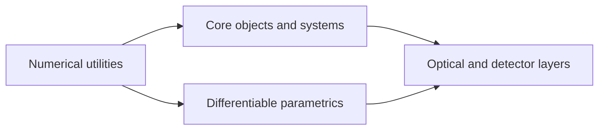

<!-- Generated by docs/scripts/generate_api_mds.py; do not edit. -->

# API

This generated map separates the main dLux contracts at a readable scale. Select a section for its module map, then a module for local inheritance and complete API documentation.

