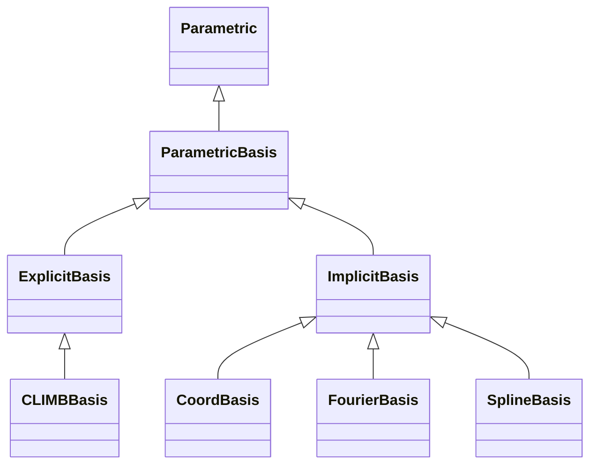

# Bases

## Inheritance

???+ info "ParametricBasis"
    ::: dLux.parametric.bases.ParametricBasis

???+ info "ExplicitBasis"
    ::: dLux.parametric.bases.ExplicitBasis

???+ info "ImplicitBasis"
    ::: dLux.parametric.bases.ImplicitBasis

???+ info "CoordBasis"
    ::: dLux.parametric.bases.CoordBasis

???+ info "CLIMBBasis"
    ::: dLux.parametric.bases.CLIMBBasis

???+ info "FourierBasis"
    ::: dLux.parametric.bases.FourierBasis

???+ info "SplineBasis"
    ::: dLux.parametric.bases.SplineBasis
