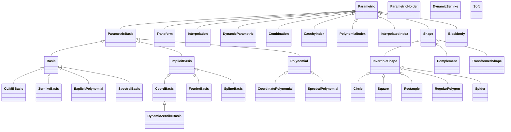

# Parametric API

This diagram is generated from the public API. Hover over a class for its direct attributes and methods, or select it to open the full reference.

```mermaid
classDiagram
    class dLux_parametric_bases_ParametricBasis["ParametricBasis"]
    class dLux_parametric_bases_Basis["Basis"]
    class dLux_parametric_bases_ImplicitBasis["ImplicitBasis"]
    class dLux_parametric_bases_CoordBasis["CoordBasis"]
    class dLux_parametric_bases_CLIMBBasis["CLIMBBasis"]
    class dLux_parametric_bases_FourierBasis["FourierBasis"]
    class dLux_parametric_bases_SplineBasis["SplineBasis"]
    class dLux_parametric_parametrics_Parametric["Parametric"]
    class dLux_parametric_parametrics_ParametricHolder["ParametricHolder"]
    class dLux_parametric_parametrics_Transform["Transform"]
    class dLux_parametric_parametrics_Interpolation["Interpolation"]
    class dLux_parametric_parametrics_DynamicParametric["DynamicParametric"]
    class dLux_parametric_parametrics_Combination["Combination"]
    class dLux_parametric_polynomials_DynamicZernike["DynamicZernike"]
    class dLux_parametric_polynomials_ZernikeBasis["ZernikeBasis"]
    class dLux_parametric_polynomials_DynamicZernikeBasis["DynamicZernikeBasis"]
    class dLux_parametric_polynomials_Polynomial["Polynomial"]
    class dLux_parametric_polynomials_ExplicitPolynomial["ExplicitPolynomial"]
    class dLux_parametric_polynomials_CoordinatePolynomial["CoordinatePolynomial"]
    class dLux_parametric_refractive_CauchyIndex["CauchyIndex"]
    class dLux_parametric_refractive_PolynomialIndex["PolynomialIndex"]
    class dLux_parametric_refractive_InterpolatedIndex["InterpolatedIndex"]
    class dLux_parametric_shapes_Shape["Shape"]
    class dLux_parametric_shapes_InvertibleShape["InvertibleShape"]
    class dLux_parametric_shapes_Soft["Soft"]
    class dLux_parametric_shapes_Circle["Circle"]
    class dLux_parametric_shapes_Square["Square"]
    class dLux_parametric_shapes_Rectangle["Rectangle"]
    class dLux_parametric_shapes_RegularPolygon["RegularPolygon"]
    class dLux_parametric_shapes_Spider["Spider"]
    class dLux_parametric_shapes_Complement["Complement"]
    class dLux_parametric_shapes_TransformedShape["TransformedShape"]
    class dLux_parametric_spectral_SpectralPolynomial["SpectralPolynomial"]
    class dLux_parametric_spectral_SpectralBasis["SpectralBasis"]
    class dLux_parametric_spectral_Blackbody["Blackbody"]
    dLux_parametric_parametrics_Parametric <|-- dLux_parametric_bases_ParametricBasis
    click dLux_parametric_bases_ParametricBasis href "../bases/#dLux.parametric.bases.ParametricBasis" "Attributes: coefficients, shape · Properties: coeffs, c, alpha, coefficient_shape · Methods: evaluate_basis(), solve_basis()"
    dLux_parametric_bases_ParametricBasis <|-- dLux_parametric_bases_Basis
    click dLux_parametric_bases_Basis href "../bases/#dLux.parametric.bases.Basis" "Attributes: coefficients, shape, basis · Methods: evaluate(), solve_basis()"
    dLux_parametric_bases_ParametricBasis <|-- dLux_parametric_bases_ImplicitBasis
    click dLux_parametric_bases_ImplicitBasis href "../bases/#dLux.parametric.bases.ImplicitBasis" "Attributes: coefficients, shape · Methods: calculate_basis(), evaluate(), solve_basis()"
    dLux_parametric_bases_ImplicitBasis <|-- dLux_parametric_bases_CoordBasis
    click dLux_parametric_bases_CoordBasis href "../bases/#dLux.parametric.bases.CoordBasis" "Attributes: coefficients, shape · Methods: get_coordinates()"
    dLux_parametric_bases_Basis <|-- dLux_parametric_bases_CLIMBBasis
    click dLux_parametric_bases_CLIMBBasis href "../bases/#dLux.parametric.bases.CLIMBBasis" "Attributes: coefficients, shape, basis, values, oversample · Methods: evaluate_latent(), evaluate()"
    dLux_parametric_bases_ImplicitBasis <|-- dLux_parametric_bases_FourierBasis
    click dLux_parametric_bases_FourierBasis href "../bases/#dLux.parametric.bases.FourierBasis" "Attributes: coefficients, shape, kernels · Methods: calculate_basis(), evaluate(), resize()"
    dLux_parametric_bases_ImplicitBasis <|-- dLux_parametric_bases_SplineBasis
    click dLux_parametric_bases_SplineBasis href "../bases/#dLux.parametric.bases.SplineBasis" "Attributes: coefficients, shape, knot_coords, sample_coords, method · Methods: calculate_basis(), evaluate()"
    click dLux_parametric_parametrics_Parametric href "../parametrics/#dLux.parametric.parametrics.Parametric" "Methods: evaluate(), map(), integrate()"
    click dLux_parametric_parametrics_ParametricHolder href "../parametrics/#dLux.parametric.parametrics.ParametricHolder" "Methods: resolve()"
    dLux_parametric_parametrics_Parametric <|-- dLux_parametric_parametrics_Transform
    click dLux_parametric_parametrics_Transform href "../parametrics/#dLux.parametric.parametrics.Transform" "Attributes: parametric, transformation · Methods: evaluate()"
    dLux_parametric_parametrics_Parametric <|-- dLux_parametric_parametrics_Interpolation
    click dLux_parametric_parametrics_Interpolation href "../parametrics/#dLux.parametric.parametrics.Interpolation" "Attributes: knots, values, method, extrapolate · Methods: evaluate(), integrate()"
    dLux_parametric_parametrics_Parametric <|-- dLux_parametric_parametrics_DynamicParametric
    click dLux_parametric_parametrics_DynamicParametric href "../parametrics/#dLux.parametric.parametrics.DynamicParametric" "Attributes: parametric, transformation · Methods: evaluate()"
    dLux_parametric_parametrics_Parametric <|-- dLux_parametric_parametrics_Combination
    click dLux_parametric_parametrics_Combination href "../parametrics/#dLux.parametric.parametrics.Combination" "Attributes: parametrics, operation · Methods: validate_operation(), combine(), values(), evaluate()"
    click dLux_parametric_polynomials_DynamicZernike href "../polynomials/#dLux.parametric.polynomials.DynamicZernike" "Attributes: j, n, m, name, _c, _k · Methods: calculate()"
    dLux_parametric_bases_Basis <|-- dLux_parametric_polynomials_ZernikeBasis
    click dLux_parametric_polynomials_ZernikeBasis href "../polynomials/#dLux.parametric.polynomials.ZernikeBasis" "Attributes: coefficients, shape, basis"
    dLux_parametric_bases_CoordBasis <|-- dLux_parametric_polynomials_DynamicZernikeBasis
    click dLux_parametric_polynomials_DynamicZernikeBasis href "../polynomials/#dLux.parametric.polynomials.DynamicZernikeBasis" "Attributes: coefficients, shape, zernikes, nsides, diameter · Methods: calculate_basis()"
    dLux_parametric_bases_ParametricBasis <|-- dLux_parametric_polynomials_Polynomial
    click dLux_parametric_polynomials_Polynomial href "../polynomials/#dLux.parametric.polynomials.Polynomial" "Attributes: coefficients, shape, powers · Methods: calculate_basis(), evaluate(), solve_basis()"
    dLux_parametric_bases_Basis <|-- dLux_parametric_polynomials_ExplicitPolynomial
    click dLux_parametric_polynomials_ExplicitPolynomial href "../polynomials/#dLux.parametric.polynomials.ExplicitPolynomial" "Attributes: coefficients, shape, basis, powers"
    dLux_parametric_polynomials_Polynomial <|-- dLux_parametric_polynomials_CoordinatePolynomial
    click dLux_parametric_polynomials_CoordinatePolynomial href "../polynomials/#dLux.parametric.polynomials.CoordinatePolynomial" "Attributes: coefficients, shape, powers, ndim · Methods: calculate_basis()"
    dLux_parametric_parametrics_Parametric <|-- dLux_parametric_refractive_CauchyIndex
    click dLux_parametric_refractive_CauchyIndex href "../refractive/#dLux.parametric.refractive.CauchyIndex" "Attributes: coefficients, scale · Methods: evaluate()"
    dLux_parametric_parametrics_Parametric <|-- dLux_parametric_refractive_PolynomialIndex
    click dLux_parametric_refractive_PolynomialIndex href "../refractive/#dLux.parametric.refractive.PolynomialIndex" "Attributes: coefficients, scale · Methods: evaluate()"
    dLux_parametric_parametrics_Parametric <|-- dLux_parametric_refractive_InterpolatedIndex
    click dLux_parametric_refractive_InterpolatedIndex href "../refractive/#dLux.parametric.refractive.InterpolatedIndex" "Attributes: wavelengths, indices, method, extrapolate · Methods: evaluate()"
    dLux_parametric_parametrics_Parametric <|-- dLux_parametric_shapes_Shape
    click dLux_parametric_shapes_Shape href "../shapes/#dLux.parametric.shapes.Shape" "Properties: extent"
    dLux_parametric_shapes_Shape <|-- dLux_parametric_shapes_InvertibleShape
    click dLux_parametric_shapes_InvertibleShape href "../shapes/#dLux.parametric.shapes.InvertibleShape" "Attributes: edge, invert · Methods: evaluate(), evaluate_hard(), evaluate_soft()"
    click dLux_parametric_shapes_Soft href "../shapes/#dLux.parametric.shapes.Soft" "Attributes: pixels · Methods: clip()"
    dLux_parametric_shapes_InvertibleShape <|-- dLux_parametric_shapes_Circle
    click dLux_parametric_shapes_Circle href "../shapes/#dLux.parametric.shapes.Circle" "Attributes: diameter · Properties: extent · Methods: evaluate_hard(), evaluate_soft()"
    dLux_parametric_shapes_InvertibleShape <|-- dLux_parametric_shapes_Square
    click dLux_parametric_shapes_Square href "../shapes/#dLux.parametric.shapes.Square" "Attributes: width · Properties: extent · Methods: evaluate_hard(), evaluate_soft()"
    dLux_parametric_shapes_InvertibleShape <|-- dLux_parametric_shapes_Rectangle
    click dLux_parametric_shapes_Rectangle href "../shapes/#dLux.parametric.shapes.Rectangle" "Attributes: width, height · Properties: extent · Methods: evaluate_hard(), evaluate_soft()"
    dLux_parametric_shapes_InvertibleShape <|-- dLux_parametric_shapes_RegularPolygon
    click dLux_parametric_shapes_RegularPolygon href "../shapes/#dLux.parametric.shapes.RegularPolygon" "Attributes: diameter, nsides · Properties: extent · Methods: evaluate_hard(), evaluate_soft()"
    dLux_parametric_shapes_InvertibleShape <|-- dLux_parametric_shapes_Spider
    click dLux_parametric_shapes_Spider href "../shapes/#dLux.parametric.shapes.Spider" "Attributes: width, angles · Methods: evaluate_hard(), evaluate_soft()"
    dLux_parametric_shapes_Shape <|-- dLux_parametric_shapes_Complement
    click dLux_parametric_shapes_Complement href "../shapes/#dLux.parametric.shapes.Complement" "Attributes: shape · Properties: extent · Methods: evaluate()"
    dLux_parametric_shapes_Shape <|-- dLux_parametric_shapes_TransformedShape
    click dLux_parametric_shapes_TransformedShape href "../shapes/#dLux.parametric.shapes.TransformedShape" "Attributes: shape, transformation · Properties: extent · Methods: evaluate()"
    dLux_parametric_polynomials_Polynomial <|-- dLux_parametric_spectral_SpectralPolynomial
    click dLux_parametric_spectral_SpectralPolynomial href "../spectral/#dLux.parametric.spectral.SpectralPolynomial" "Attributes: normalise · Methods: evaluate()"
    dLux_parametric_bases_Basis <|-- dLux_parametric_spectral_SpectralBasis
    click dLux_parametric_spectral_SpectralBasis href "../spectral/#dLux.parametric.spectral.SpectralBasis" "Attributes: normalise · Methods: evaluate()"
    dLux_parametric_parametrics_Parametric <|-- dLux_parametric_spectral_Blackbody
    click dLux_parametric_spectral_Blackbody href "../spectral/#dLux.parametric.spectral.Blackbody" "Attributes: temperature, normalise · Methods: evaluate()"
```
