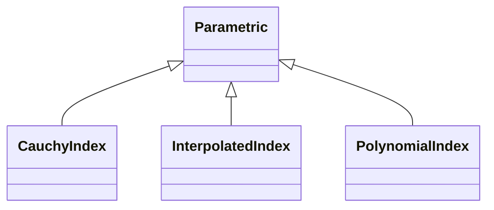

# Refractive

## Inheritance

???+ info "CauchyIndex"
    ::: dLux.parametric.refractive.CauchyIndex

???+ info "PolynomialIndex"
    ::: dLux.parametric.refractive.PolynomialIndex

???+ info "InterpolatedIndex"
    ::: dLux.parametric.refractive.InterpolatedIndex
