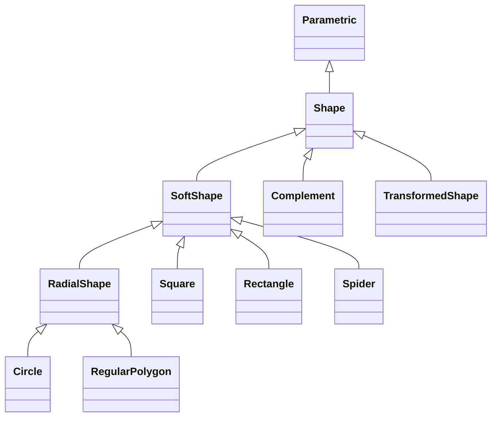

# Shapes

## Inheritance

???+ info "Shape"
    ::: dLux.parametric.shapes.Shape

???+ info "SoftShape"
    ::: dLux.parametric.shapes.SoftShape

???+ info "RadialShape"
    ::: dLux.parametric.shapes.RadialShape

???+ info "Circle"
    ::: dLux.parametric.shapes.Circle

???+ info "Square"
    ::: dLux.parametric.shapes.Square

???+ info "Rectangle"
    ::: dLux.parametric.shapes.Rectangle

???+ info "RegularPolygon"
    ::: dLux.parametric.shapes.RegularPolygon

???+ info "Spider"
    ::: dLux.parametric.shapes.Spider

???+ info "Complement"
    ::: dLux.parametric.shapes.Complement

???+ info "TransformedShape"
    ::: dLux.parametric.shapes.TransformedShape
