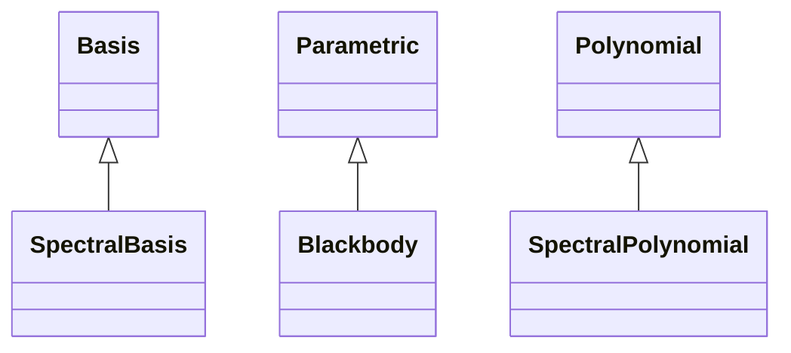

# Spectral

## Inheritance

???+ info "SpectralPolynomial"
    ::: dLux.parametric.spectral.SpectralPolynomial

???+ info "SpectralBasis"
    ::: dLux.parametric.spectral.SpectralBasis

???+ info "Blackbody"
    ::: dLux.parametric.spectral.Blackbody
