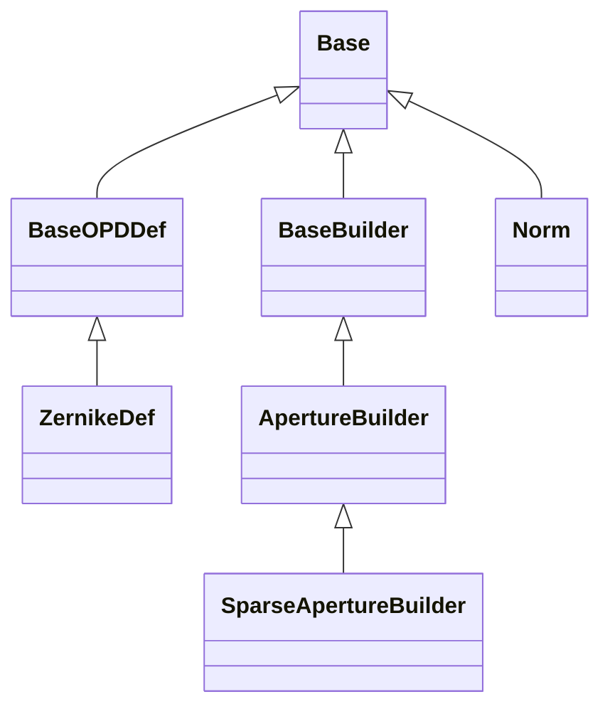

<!-- Generated by docs/scripts/generate_api_mds.py; do not edit. -->

# Builders

## Inheritance

???+ info "BaseBuilder"
    ::: dLux.prebuilt.builders.BaseBuilder

???+ info "BaseOPDDef"
    ::: dLux.prebuilt.builders.BaseOPDDef

???+ info "Norm"
    ::: dLux.prebuilt.builders.Norm

???+ info "ZernikeDef"
    ::: dLux.prebuilt.builders.ZernikeDef

???+ info "ApertureBuilder"
    ::: dLux.prebuilt.builders.ApertureBuilder

???+ info "SparseApertureBuilder"
    ::: dLux.prebuilt.builders.SparseApertureBuilder
