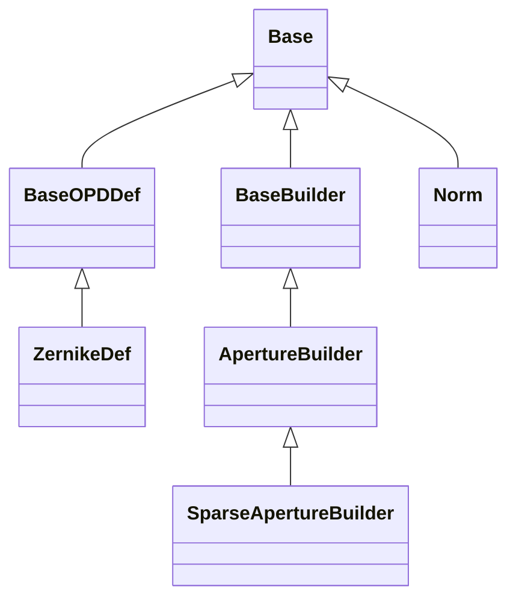
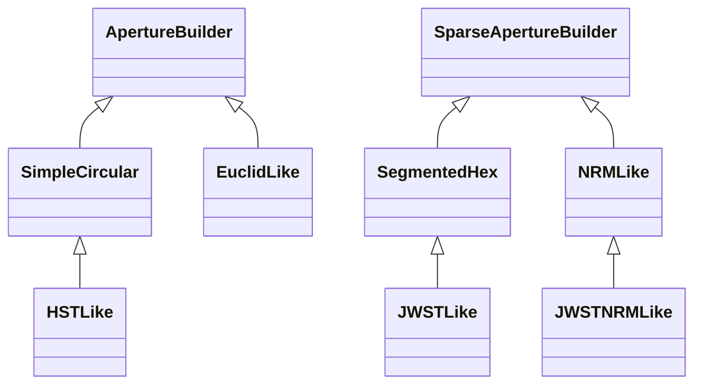

<!-- Generated by docs/scripts/generate_api_mds.py; do not edit. -->

# Prebuilt API

These maps are generated from the public API. Each module is shown separately so its complete local structure remains readable. Select a class to open its reference, or follow the module heading for functions and full documentation.

## [Builders](builders.md)

## [Prebuilt](prebuilt.md)

