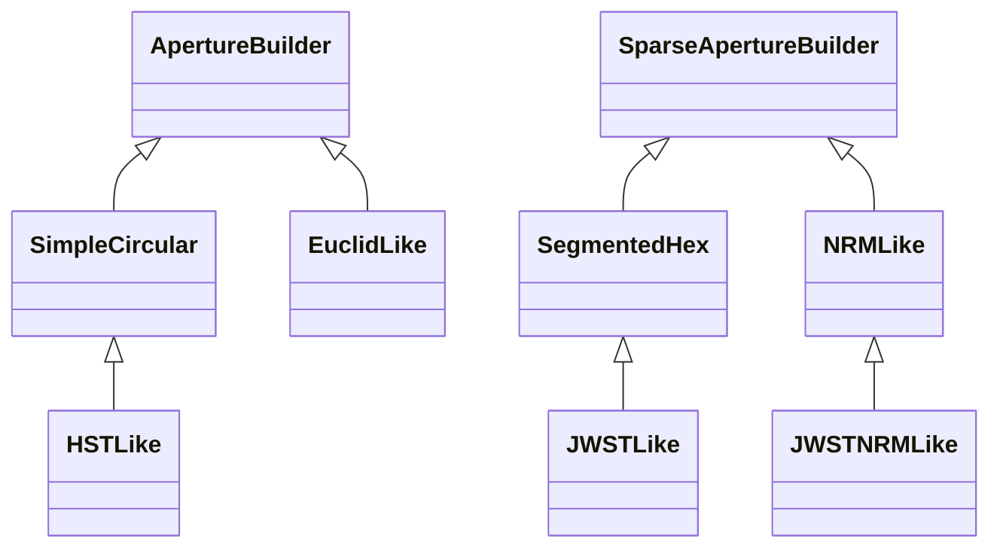

<!-- Generated by docs/scripts/generate_api_mds.py; do not edit. -->

# Prebuilt

## Inheritance

???+ info "SimpleCircular"
    ::: dLux.prebuilt.prebuilt.SimpleCircular

???+ info "SegmentedHex"
    ::: dLux.prebuilt.prebuilt.SegmentedHex

???+ info "NRMLike"
    ::: dLux.prebuilt.prebuilt.NRMLike

???+ info "HSTLike"
    ::: dLux.prebuilt.prebuilt.HSTLike

???+ info "JWSTLike"
    ::: dLux.prebuilt.prebuilt.JWSTLike

???+ info "JWSTNRMLike"
    ::: dLux.prebuilt.prebuilt.JWSTNRMLike

???+ info "EuclidLike"
    ::: dLux.prebuilt.prebuilt.EuclidLike
