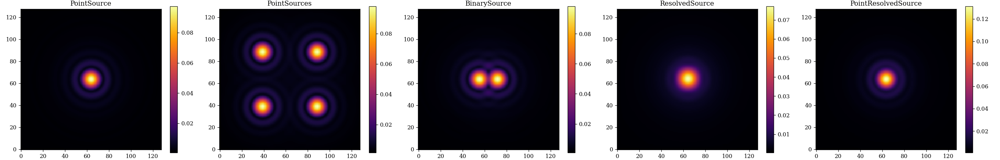

# Source: source.py

This module contains the classes that define the behaviour of sources in dLux.

There are five public classes:

- `PointSource`
- `PointSources`
- `BinarySource`
- `ResolvedSource`
- `PointResolvedSource`

Source classes store `Spectrum` objects that define the spectral properties of the source. They also store the position of the source on the sky, and the flux of the source.

All public clases have two main methods:

1. `normalise()` Returns a new source object with the relevant attributes normalised.
2. `model(optics)` Models the source through the optics.

??? info "PointSource"
    ::: dLux.sources.PointSource

??? info "PointSources"
    ::: dLux.sources.PointSources

??? info "BinarySource"
    ::: dLux.sources.BinarySource

??? info "ResolvedSource"
    ::: dLux.sources.ResolvedSource

??? info "PointResolvedSource"
    ::: dLux.sources.PointResolvedSource

---

# Examples

Lets have a look at how to construct all of these different classes. First we construct some optics to model the sources through.

```python
import jax.numpy as np
import dLux as dl

# Define the optical parameters
wf_npixels = 256
diameter = 1 # meters
psf_npixels = 128
psf_pixel_scale = 0.1 # arcseconds
psf_oversample = 4

# Use ApertureFactory class to make a simple circular aperture
aperture = dl.ApertureFactory(wf_npixels)

# Construct the optics class
optics = dl.AngularOptics(wf_npixels, diameter, aperture, 
    psf_npixels, psf_pixel_scale, psf_oversample)
```

Now we define the different source classes.

```python
# Define wavelengths
wavelengths = np.linspace(1e-6, 1.2e-6, 5) # meters

# Construct PointSource
sourcess = [dl.PointSource(wavelengths)]

# Construct PointSources
positions = 3e-6 * np.array([[1, 1], [1, -1], [-1, 1], [-1, -1]])
sources.append(dl.PointSources(wavelengths, positions))

# Construct BinarySource
separation = 2e-6 # radians
sources.append(dl.BinarySource(wavelengths, separation=separation))

# Construct ResolvedSource
distribution = np.ones([10, 10])
sources.append(dl.ResolvedSource(wavelengths, distribution=distribution))

# Construct PointResolvedSource
distribution = np.ones([10, 10])
sources.append(dl.PointResolvedSource(wavelengths, distribution=distribution, 
    contrast=3))
```

??? abstract "Plotting Code"
    ```python
    import matplotlib.pyplot as plt
    titles = ["PointSource", "PointSources", "BinarySource", "ResolvedSource",
        "PointResolvedSource"]

    plt.figure(figsize=(25, 4))
    for i in range(5):
        psf = sources[i].model(optics)
        plt.subplot(1, 5, i+1)
        plt.title(titles[i])
        plt.imshow(psf**0.5)
        plt.colorbar()
    plt.savefig('assets/sources.png')
    ```

