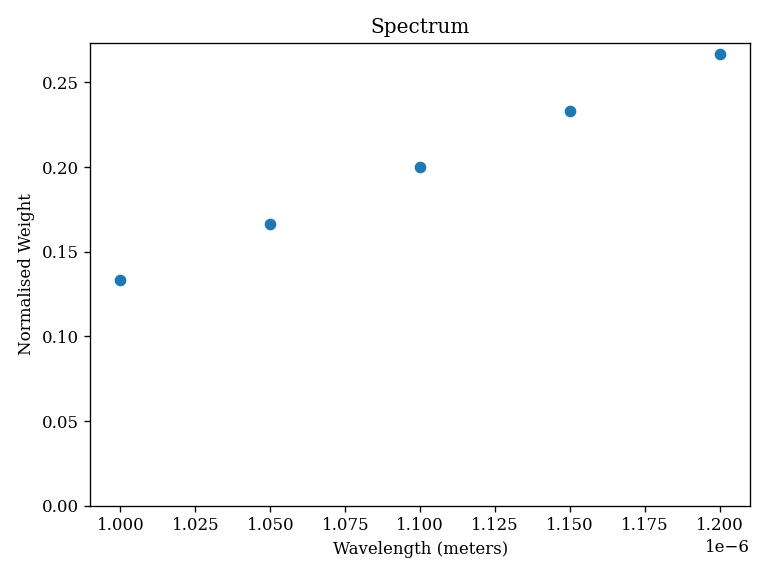

# Spectra: `spectra.py`

This module contains the classes that define the behaviour of spectra in ∂Lux.

There are two public classes:

- `Spectrum`
- `PolySpectrum`

The `Spectrum` class is a generic class that allows for the definition of spectra by a simple wavelength and weights. The `PolySpectrum` class provides a generic polynomial spectrum.

??? info "Spectrum"
    ::: dLux.spectra.Spectrum

??? info "PolySpectrum"
    ::: dLux.spectra.PolySpectrum

---

# Examples

Here is how to construct and plot a simple `Spectrum` object.

```python
import dLux as dl
import jax.numpy as np

# Array based spectrum
wavelengths = np.linspace(1e-6, 1.2e-6, 5) # metres
weights = np.linspace(.5, 1, 5)
spectrum = dl.Spectrum(wavelengths, weights)
```

??? abstract "Plotting Code"
    ```python
    plt.title("Spectrum")
    plt.scatter(spectrum.wavelengths, spectrum.weights)
    plt.ylim(0)
    plt.xlabel("Wavelength (meters)")
    plt.ylabel("Normalised Weight")
    plt.savefig('assets/spectrum.png')
    ```

