<!-- Generated by docs/scripts/generate_api_mds.py; do not edit. -->

# Utils API

This map is generated from the public API. Select a module to open its classes, functions, and local inheritance diagram.

```mermaid
flowchart LR
    dLux_utils_abcd["Abcd"]
    click dLux_utils_abcd href "../abcd/" "Public API: abcd_surface_power, abcd_lens, abcd_mirror, abcd_free_space, abcd_fraunhofer, compose_abcd, is_surface, is_free_space, abcd_effective_focal_length, abcd_paraxial_power, abcd_geometric_magnification, abcd_angular_magnification, abcd_distance, abcd_front_focal_length, abcd_back_focal_length, abcd_unimodularity"
    dLux_utils_apertures["Apertures"]
    click dLux_utils_apertures href "../apertures/" "Public API: non_redundant_support, circular_aperture, segmented_aperture, sparse_aperture, hst_like, jwst_like, euclid_like"
    dLux_utils_array_ops["Array Ops"]
    click dLux_utils_array_ops href "../array_ops/" "Public API: pad_to, crop_to, resize, downsample, paste"
    dLux_utils_coordinates["Coordinates"]
    click dLux_utils_coordinates href "../coordinates/" "Public API: cart2polar, polar2cart, pixel_coords, nd_axes, nd_coords, translate_coords, compress_coords, shear_coords, rotate_coords, distort_coords"
    dLux_utils_fourier["Fourier"]
    click dLux_utils_fourier href "../fourier/" "Public API: fourier_kernel_1d, fourier_kernels, eval_fourier_basis"
    dLux_utils_geometry["Geometry"]
    click dLux_utils_geometry href "../geometry/" "Public API: combine, circle, square, rectangle, reg_polygon, spider, soft_circle, soft_square, soft_rectangle, soft_reg_polygon, soft_spider"
    dLux_utils_helpers["Helpers"]
    click dLux_utils_helpers href "../helpers/" "Public API: map2array, list2dictionary, insert_layer, remove_layer, imshow_extent, missing_attribute_error, resolve_attr, from_complex, as_size, as_axis, to_value"
    dLux_utils_interpolation["Interpolation"]
    click dLux_utils_interpolation href "../interpolation/" "Public API: interp, scale, rotate"
    dLux_utils_math["Math"]
    click dLux_utils_math href "../math/" "Public API: gaussian, mv_gaussian, factorial, triangular_number, eval_basis, solve_basis, nandiv"
    dLux_utils_misc["Misc"]
    click dLux_utils_misc href "../misc/" "Public API: soft_binarise"
    dLux_utils_norms["Norms"]
    click dLux_utils_norms href "../norms/" "Public API: l1_norm, l2_norm, max_norm, rms_norm, p2v_norm"
    dLux_utils_optics["Optics"]
    click dLux_utils_optics href "../optics/" "Public API: wavenumber, opd2phase, phase2opd, fringe_size, tilt_opd, tilt"
    dLux_utils_polarisation["Polarisation"]
    click dLux_utils_polarisation href "../polarisation/" "Public API: horizontal_polariser, vertical_polariser, rhc_polariser, lhc_polariser, quarter_wave_plate, half_wave_plate, apply_jones, rotate_jones, linear_polariser, retarder, jones_to_stokes"
    dLux_utils_polynomials["Polynomials"]
    click dLux_utils_polynomials href "../polynomials/" "Public API: polynomial_powers, polynomial_basis, zernike_name, noll_indices, radial_orders_to_indices, zernike_factors, zernike, zernike_fast, zernike_basis, polike, polike_fast, polike_basis"
    dLux_utils_propagation["Propagation"]
    click dLux_utils_propagation href "../propagation/" "Public API: FFT_pad, FFT_spec, FFT_shift, FFT_ramp, FFT, MFT, ABCD_MFT, ABCD_FFT, ASM"
    dLux_utils_source["Source"]
    click dLux_utils_source href "../source/" "Public API: fluxes_from_contrast, positions_from_sep"
    dLux_utils_units["Units"]
    click dLux_utils_units href "../units/" "Public API: convert, rad2arcsec, rad2deg, rad2arcmin, deg2rad, deg2arcmin, deg2arcsec, arcmin2rad, arcmin2deg, arcmin2arcsec, arcsec2rad, arcsec2deg, arcsec2arcmin"
```

