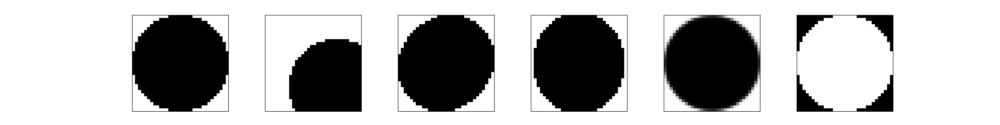
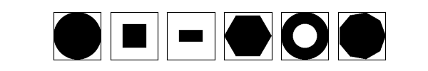
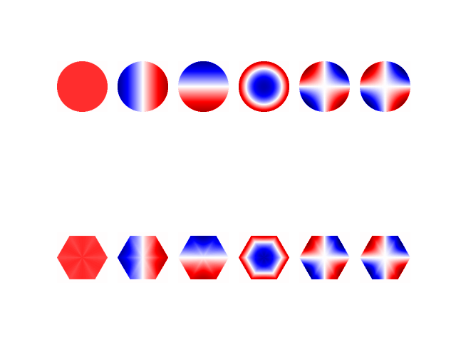

# An Overview of the Apertures.
## Introduction
`dLux` implements a number of aperture components for telescopes. Because
`dLux` is powered by autodiff, the shape of the aperture can be learned. 
Theoretically, you could learn the value of every pixel in the aperture. 
Learning by pixel would be computationally expensive and the model could 
chase noise making the results meaningless. Instead the apertures that we 
have implemented are **minimally paramtrised**. *Minimal* is perhaps a 
misnomer as we have allowed for **flexible manipulation** of the apertures. 


In general the apertures can be, *strained, compressed, rotated* and 
*translated* arround the plane. However, the effect on the point spread 
function (psf) due to changes in the aperture is one of the smallest 
sources of error in most cases. A notable counter example is the hubble 
space telescope, upon which the two apertures are missaligned considerably.
Anomalies aside, before trying to learn a deformation in your aperture 
ask make sure your model is accounting for more common, larger sources 
of error. 


When working with gradients we found that it was best to avoid discontinuous 
functions. However, an aperture is discontinuous across the boundary. 
To avoid the undefined gradients that this can lead to we developed a 
system of soft-edging the apertures. In particular we avoided using a 
nearest-neighbour interpolator (or linear interpolator) by choosing a 
sigmoid like function across the boundary. Naturally this leads to a 
degree of approximation, but in general works.


## Static Apertures
The inbuild flexibility of the `dLux.apertures` module is not all good.
The evaluation of the apertures remains much cheaper than the calculations
that carry the wavefront from one plane to another, but in situations 
where speed matters they are a burden. Moreover, we anticipate that most
models **will not** need to learn the parameters of the aperture. To 
avoid extra calculations we created a related class `StaticAperture` that
works to pre-compute the aperture making optimisation faster. As well as 
providing `StaticAperture` we also created `StaticAberratedAperture` to 
pre-compute basis functions. 


## Aberrated Apertures
Phase retrieval is synonomous with modern physical optics. `dLux` provides 
a streamlined, **physical interface** for phase retrieval in the 
`dLux.apertures` using the `AberratedAperture` class. This class wraps 
a standard `dLux.apertures.Aperture` in a set of basis vectors of your 
chosing. In general, these basis vectors are derived from the *Zernike*
polynomials, via orthonormalisation. However, orthonormalisation is 
expensive and a large amount of work has gone into optimising it. 


For regular polygons, the orthonormalisation has analytic solutions. 
We have implemented this along with a mechanism to pre-evaluate the 
coefficients of the basis vectors. This means that the evaluation is 
**very fast** allowing the shape of the aperture to be learned along 
with the basis and the coefficients. The basis will be updated to 
follow the shape of the aperture. This works by transforming the 
paraxial coordinates of wavefront into those of the apertures. 


An important result is that the basis vectors might lose their 
orthonormality. This is OK. Since a typical model does not use an 
infinite number of basis vectors it does not make sense to split hairs 
of the set is not completely orhtonormal. All that matters is if the 
correct order of error is spanned. This will depend upon your scenario.
The orthonormalisation step is debatebly important. Depending on the 
number of terms and their order, it can essentially reduce to just 
cutting an aperture-shaped hole in the corresponding *Zernike*.


We have implemented special cases for `CircularAperture` and 
`HexagonalAperture` because these are common cases. Outside of regular
polygons, circles and hexagons, the orthonormalisation needs to be 
performed at each pass. This presents a major barrier to learning 
the shape of an `AberratedAperture` because it significantly increases
the computation complexity. An active avenue of improvent is in the 
handling of arbitrary apertures.


## Usage and Examples
Here is a complete list of the apertures that we have implemented.
 - Simple, shaped apertures:
   - `AnnularAperture`
   - `CircularAperture`
   - `HexagonalAperture`
   - `SquareAperture`
   - `RectangularAperture`
   - `RegularPolygonalAperture`
   - `IrregularPolygonalAperture`
 - Composite apertures:
   - `CompoundAperture`
   - `MultiAperture`
 - `AberratedAperture`
 - Static apertures:
   - `StaticAperture`
   - `StaticAberratedAperture`
 - `UniformSpider`
In general they function as you might intuitively expect. The 
notable exception to this rule is the composite apertures, of 
which there are two. The `CompoundAperture` is for overlapping 
apertures that you wish to treat as a single aperture. For example,
the components of a spider that is fused to an obstruction and 
pupil will not move very much with respect to one another. 
Indeed for all intents and purposes we can treat this as static.
However, **it might** move with respect to a secondary pupil 
acting as the camera lens. This particular circumstance was the 
case on the Hubble Space Telescope.


Now let's write some code. We can create a basic circular aperture
at the centre of the paraxial coordinate system and with radius 
of $1m$ using,
```python 
circ = CircularAperture(1.) # Default w. radius: 1m
circ = CircularAperture(1., centre=[.5, .5])
circ = CircularAperture(1., strain=[.05, .05])
circ = CircularAperture(1., compression=[1.05, .95])
circ = CircularAperture(1., softening=True)
circ = CircularAperture(1., occulting=True)
```
Running this script produces the output shown in Fig. 1.



The same can be done for all of the other apertures which in 
general have only a few non-default parameters, such as length 
and width for the `RectangularAperture`. The notable exception 
to this rule is `IrregularPolygonalAperture` which takes a 
list of vertices as a non-default parameter. This class can be 
used to generate many of the other pre-loaded parameters but the 
cost of generality is performance. Moreover, it is very unlikely
that learning the position of the vertices is ever going to be 
necessary, but it is possible. Fig. 2. shows plots of all the apertures. 



The `AberratedApertures`, which contain basis implementation in 
`dLux` takes in three parameters. The *noll indices* of the basis 
vectors, the *aperture* and the *coefficients* of those basis 
vectors. The basis vectors shown in Fig. 3. were generated using 
the following code,
```python 
shape = 10
aber_circ = AberratedAperture(
    noll_inds = np.arange(1, shape, dtype=float),
    coeffs = np.ones(shape),
    aperture = CircularAperture(1.)
)
```
The benefit of this representation is that we can simultaneously 
learn abitrary aberrations represented using *Zernike* polynomials 
and the shape/position of the aperture. Although this is unlikely 
to be something that is often required it is an interesting piece 
of functionality. 



